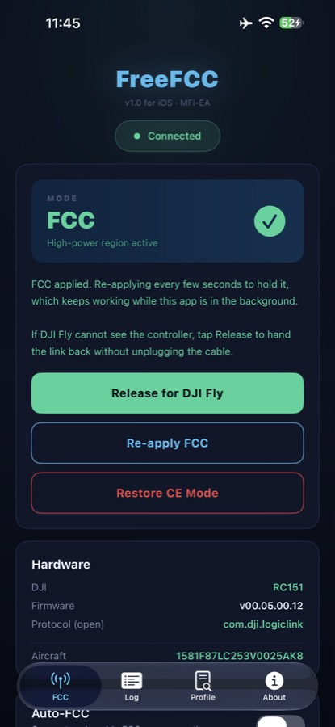
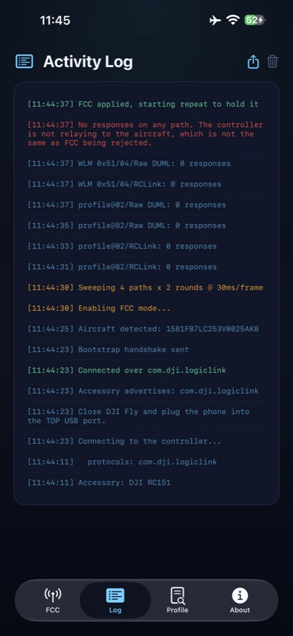
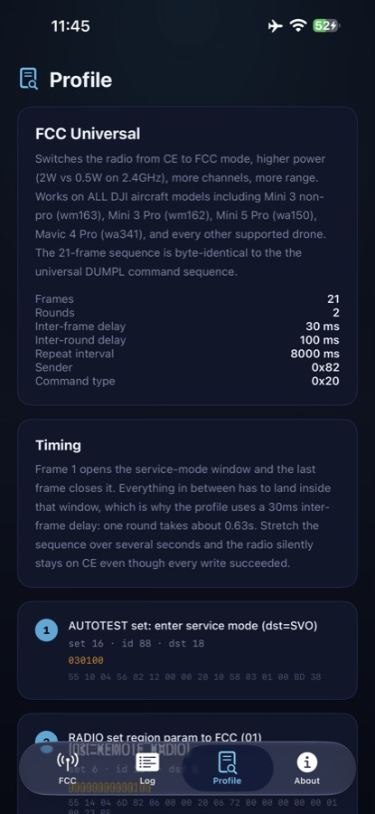
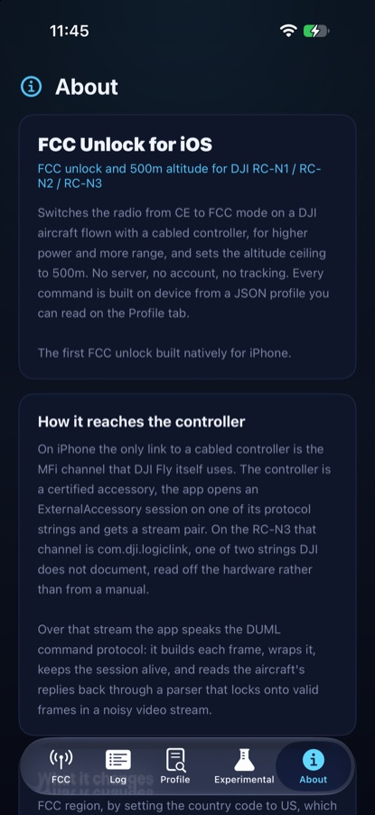
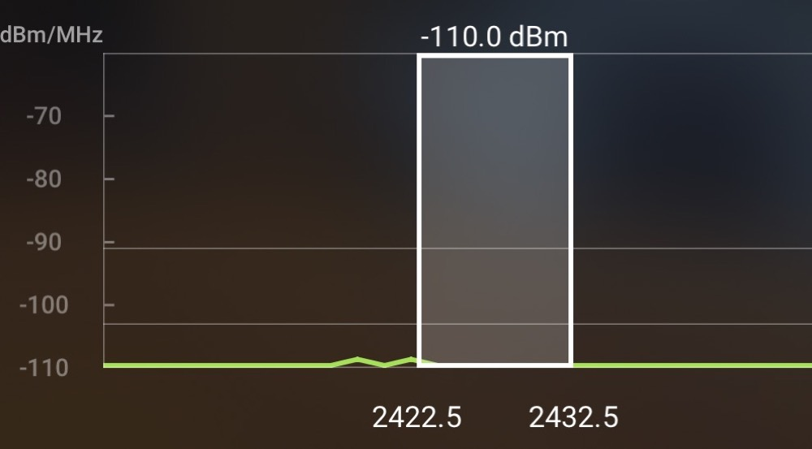

<div align="center">

# 📡 Free FCC Unlock for iOS

### FCC unlock and 500m altitude for DJI RC-N1 / RC-N2 / RC-N3, native on iPhone

[](LICENSE)
[](#)
[](#-confirmed-on-hardware)

**The first FCC unlock built natively for iPhone.** No server, no account, no
tracking. Everything runs on device.

An app by [Andrea Piani](https://www.andreapiani.com).

</div>

---

> ## ⚠️ Disclaimer
>
> For educational and research purposes. Modifying radio transmission power or
> altitude limits may violate the law where you are. In most places,
> transmitting above the power permitted for your region, or flying above the
> permitted altitude, requires authorisation from the regulator. You are solely
> responsible for compliance. If you are not sure whether this is legal where you
> live, do not use it.
>
> Not affiliated with, endorsed by, or sponsored by DJI. Using this may void your
> warranty and DJI Care Refresh coverage.

---

## ✨ What it does

| | Feature |
|---|---|
| 📶 | **FCC unlock.** Switches the radio from CE to FCC, 2W instead of 0.5W on 2.4GHz, for more channels and more range. |
| 🛰️ | **500m altitude.** Sets the flight-controller ceiling to 500m, DJI's own standard maximum. |
| 🔌 | **Native MFi.** Talks to the controller over the same certified channel DJI Fly uses, no jailbreak, no desktop, no second device. |
| 🔍 | **Readable.** Every byte sent is a plain JSON profile you can inspect on the Profile tab. |
| 🔒 | **Offline.** No server contact, no account, no tracking, ever. |
| 🔁 | **Auto-hold.** Re-applies while the app is backgrounded, so FCC survives DJI Fly reconnecting. |

## 📱 Screens

<table>
<tr>
<td align="center"><b>FCC active</b></td>
<td align="center"><b>Activity log</b></td>
<td align="center"><b>Command profile</b></td>
<td align="center"><b>About</b></td>
</tr>
<tr>
<td></td>
<td></td>
<td></td>
<td></td>
</tr>
</table>

<div align="center">

<br><sub>DJI Fly Transmission, 2.4GHz spectrum with FCC power active on an RC-N3 + DJI Neo</sub>
</div>

## ✅ Confirmed on hardware

Tested on real hardware, a **DJI RC-N3** controller cabled to an iPhone with a
**DJI Neo** aircraft: FCC power reached, verified on the DJI Fly Transmission
graph with the signal extending well past the 1km reference. Not a simulator or a
protocol mock, an actual controller and an actual drone in the air. Three things had to be right, and finding them was the work:

- 🔑 **The channel is `com.dji.logiclink`**, one of the two MFi protocol strings
  DJI does not publish. A build declaring only the three documented strings never
  sees the controller at all, because iOS hides an accessory whose protocols you
  did not declare. The string was read off the hardware.
- 🇺🇸 **The region is set by country code `US`.** The command is the WiFi Set
  Country Code the controller already accepts; the country it carries is what
  decides CE or FCC.
- 🔗 **The aircraft must be linked** when you apply, not just powered on. The
  frames reach the controller and stop there until it is relaying to a drone. The
  app shows a green link line with the aircraft serial once the drone is there.

One honest limit: this firmware answers no region-read command, so the app cannot
read the mode back. The DJI Fly Transmission graph is the confirmation.

## 🛠️ Build and install

Requirements: Xcode 26+, iOS 17+ target, an Apple ID in Xcode.

```bash
brew install xcodegen        # once
xcodegen generate
open FreeFCC.xcodeproj
```

Pick your iPhone as the destination and Run. The project signs with the team
wildcard profile, so no App Store Connect setup is needed. This is a sideload for
your own hardware, not an App Store build: it opens DJI's MFi protocol strings
and changes a regulatory radio setting.

## 🚀 Using it

The order matters. The controller only relays commands to the aircraft once
DJI Fly has woken that link, and the link stays warm for a while after DJI Fly
closes. That warm window is what the app needs.

1. Power on the **drone** and the controller, wait for them to pair.
2. **Open DJI Fly first** and wait until it shows the drone connected with a
   live camera feed. This is the step that wakes the controller-to-aircraft
   link. Skipping it is why an apply gets 0 responses even with the drone
   detected.
3. **Close DJI Fly** (swipe it away).
4. Cable the iPhone to the **TOP** USB port of the controller, the phone-cradle
   port.
5. Open FCC Unlock, tap **Connect**, wait for the green line with the aircraft
   serial, then tap **Enable FCC Mode** and let the sweep finish. A line like
   `profile@02/RCLink: 38 responses` means the aircraft answered.
6. Reopen DJI Fly, check the Transmission tab. FCC power shows on the signal
   graph reaching past the 1km reference.

FCC is RAM-based, so on some aircraft it persists across a power cycle and on
others it reverts to CE; if it reverts, repeat the steps. The app also
re-applies on an interval while it holds the link.

> **Altitude note.** The app sets the aircraft's own height ceiling to 500m, but
> DJI Fly enforces a separate altitude cap from your GPS location: in the EU that
> is 120m, and it stays 120m even with FCC power active, because that limit lives
> in the DJI Fly app, not in the drone. Raising it is a DJI Fly / location matter,
> not something this drone-side app changes.

## 🧭 How it works

The app opens an `EASession` on the controller's MFi protocol and speaks the DUML
command protocol over the stream: it builds each frame with its CRC-8 and CRC-16,
wraps it in the link envelope, keeps the session alive with a keepalive, and
parses the aircraft's replies out of a stream that also carries the video feed.

Each apply sweeps several sender and framing combinations and counts the
responses, so the Log tab names the path your hardware answered on. The region is
set with the country code and the altitude ceiling with the flight controller's
`max_height` parameter, both inside one service-mode window.

## 📂 Project layout

```
FreeFCC/
  Core/    frame builder + CRC, link envelope + stream parser, profile loader,
           MFi transport, controller (sweep, hold, region, altitude, diagnostics)
  App/     SwiftUI screens and design system
  Resources/profiles/   fcc.json (FCC + 500m), ce_restore.json
FreeFCCTests/            frames, parser, profile and altitude checks
docs/screenshots/        the images above
```

## 📜 License

GPL-3.0. See [LICENSE](LICENSE) and [NOTICE.md](NOTICE.md). The DUML protocol the
app implements is publicly documented by the
[dji-firmware-tools](https://github.com/o-gs/dji-firmware-tools) project; the iOS
app and its logic are original work.

---

<div align="center">

© 2026 Andrea Piani · NIE Z2331796-S · Tijarafe, Santa Cruz de Tenerife · Islas Canarias

[andreapiani.com](https://www.andreapiani.com)

</div>
