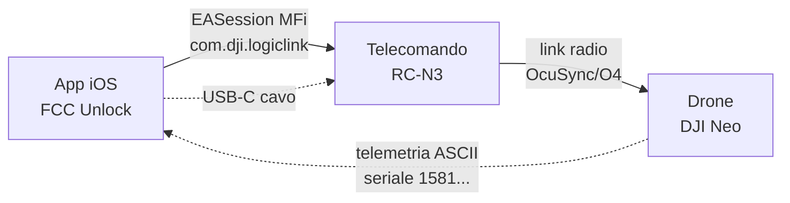
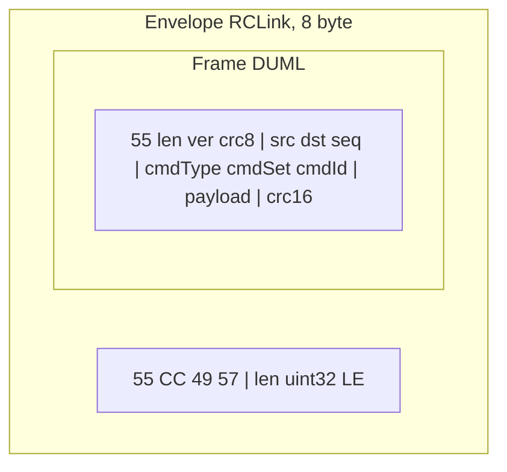
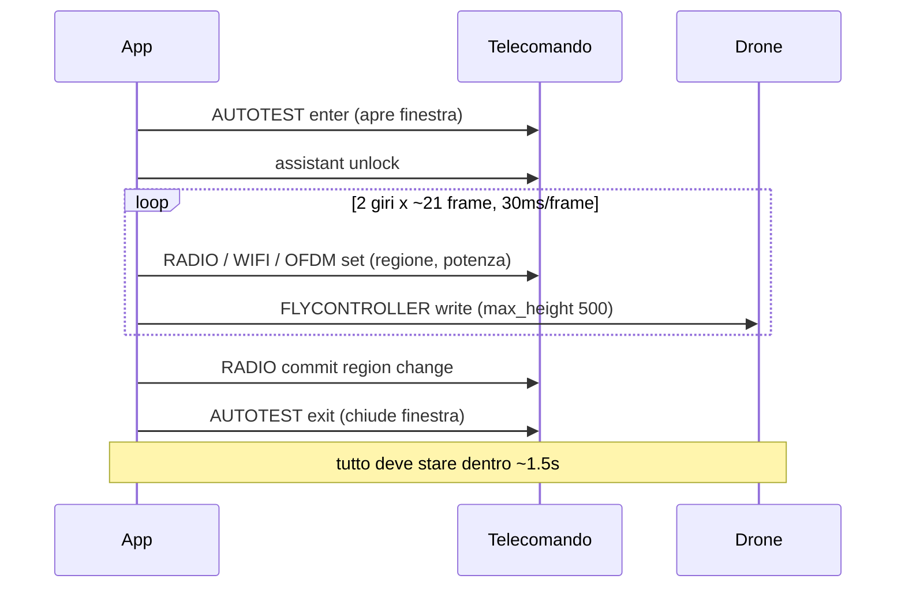

# Documentazione tecnica, FCC Unlock iOS

Come l'app abilita la modalità FCC su un telecomando DJI RC-N, cosa cambia
esattamente, perché funziona, con quali protocolli comunica con il telecomando e
il drone, e tutto ciò che è stato scoperto dai log sull'hardware reale.

Questo documento è pensato come riferimento per lo sviluppo futuro. Chi arriva
dopo deve poter capire la logica, riprodurre i risultati, e sapere dove mettere
le mani per estendere l'app senza ripartire da zero.

Autore, Andrea Piani, www.andreapiani.com.

---

## Indice

1. [Cosa fa l'app, in una frase](#1-cosa-fa-lapp-in-una-frase)
2. [La catena hardware e software](#2-la-catena-hardware-e-software)
3. [Il livello di trasporto, MFi ExternalAccessory](#3-il-livello-di-trasporto-mfi-externalaccessory)
4. [Lo stack di protocollo, DUML/DUMPL e l'envelope RCLink](#4-lo-stack-di-protocollo-dumldumpl-e-lenvelope-rclink)
5. [Formato del frame DUML sul filo](#5-formato-del-frame-duml-sul-filo)
6. [Indirizzamento, i tipi di dispositivo e gli indici](#6-indirizzamento-i-tipi-di-dispositivo-e-gli-indici)
7. [Handshake di bootstrap e keepalive](#7-handshake-di-bootstrap-e-keepalive)
8. [Il parser dello stream in ingresso](#8-il-parser-dello-stream-in-ingresso)
9. [La sequenza FCC, frame per frame](#9-la-sequenza-fcc-frame-per-frame)
10. [La finestra service-mode e il timing](#10-la-finestra-service-mode-e-il-timing)
11. [Lo sweep, la strategia di apply e il conteggio delle risposte](#11-lo-sweep-la-strategia-di-apply-e-il-conteggio-delle-risposte)
12. [Perché funziona, le tre scoperte chiave dai log](#12-perché-funziona-le-tre-scoperte-chiave-dai-log)
13. [Il loop di hold e la reversione a CE](#13-il-loop-di-hold-e-la-reversione-a-ce)
14. [Lettura della regione, il limite onesto](#14-lettura-della-regione-il-limite-onesto)
15. [I comandi RC power mode documentati](#15-i-comandi-rc-power-mode-documentati)
16. [Il ripristino CE](#16-il-ripristino-ce)
17. [La parte sperimentale, parametri di velocità e altitudine](#17-la-parte-sperimentale-parametri-di-velocità-e-altitudine)
18. [Diagnostica, census e sonde](#18-diagnostica-census-e-sonde)
19. [Come leggere un log di sessione](#19-come-leggere-un-log-di-sessione)
20. [Mappa del codice](#20-mappa-del-codice)
21. [Direzioni di sviluppo future](#21-direzioni-di-sviluppo-future)

---

## 1. Cosa fa l'app, in una frase

L'app parla al telecomando DJI attraverso il cavo, con lo stesso protocollo che
usa DJI Fly, e invia una sequenza di comandi che spostano la radio da regione CE
(0,5W, potenza europea) a regione FCC (2W, potenza americana), oltre a fissare il
tetto di altitudine a 500m. Tutto avviene sul dispositivo, senza server, senza
account, senza jailbreak.

Il punto tecnico centrale, la cosa che è stata scoperta e resa affidabile, è che
la regione radio DJI si decide con il codice paese. Impostare il codice paese a
`US` mette la radio in FCC. Il resto della sequenza serve a far arrivare quel
comando al componente giusto, dentro la finestra temporale giusta, sul canale di
comunicazione giusto.

---

## 2. La catena hardware e software

La comunicazione attraversa cinque anelli. Capire dove sta ciascuno serve a
capire dove un apply può fallire.



- **App iOS**, costruisce i frame, li incornicia, li scrive sullo stream.
- **Cavo USB-C**, va nella porta USB SUPERIORE del telecomando, quella della
  culla del telefono. La porta inferiore è di ricarica e non porta il canale
  dati MFi.
- **Telecomando**, è un accessorio MFi certificato. Riceve i frame, ne gestisce
  alcuni da solo (radio, WiFi), e ne inoltra altri via radio al drone.
- **Link radio**, il telecomando inoltra i comandi al drone solo se il link
  radio è attivo, cioè se il drone è acceso e agganciato. Questo è il punto in
  cui un apply "silenzioso" nasce.
- **Drone**, gestisce i parametri del flight controller (altitudine, velocità) e
  trasmette continuamente telemetria, dentro la quale viaggia in chiaro il suo
  numero di serie.

L'ultimo anello, la telemetria di ritorno, è ciò che l'app usa come segnale di
"il drone c'è". Il serial `1581...` compare nello stream solo quando il drone
sta effettivamente trasmettendo, quindi solo quando il telecomando lo sta
relaying. Vedere il serial equivale a sapere che la catena è completa.

---

## 3. Il livello di trasporto, MFi ExternalAccessory

Su iOS l'unico modo sanzionato di parlare con un accessorio cablato è aprire una
`EASession` tramite il framework ExternalAccessory. Il codice sta in
`FreeFCC/Core/ExternalAccessoryTransport.swift`.

### 3.1 Le stringhe di protocollo MFi

iOS non lascia aprire una sessione su un protocollo che l'app non ha dichiarato
in `Info.plist`, sotto la chiave `UISupportedExternalAccessoryProtocols`. E c'è
di peggio, iOS nasconde del tutto l'accessorio da `connectedAccessories` se
nessuna delle stringhe che l'accessorio annuncia è dichiarata dall'app. Un
elenco sbagliato si legge esattamente come "nessun telecomando collegato".

Le stringhe dichiarate sono cinque:

```
com.dji.logiclink   <- il canale comandi, NON documentato pubblicamente
com.dji.protocol     <- documentato per SDK terze parti
com.dji.common       <- documentato per SDK terze parti
com.dji.fly          <- non documentato, letto da DJI Fly
com.dji.video        <- il feed telecamera
```

Le prime tre sono quelle che DJI documenta per gli sviluppatori SDK. Non bastano.
Con solo quelle un RC-N3 restava invisibile, mentre DJI Fly sullo stesso cavo,
nello stesso istante, si collegava senza problemi. `com.dji.logiclink` e
`com.dji.fly` sono state lette direttamente dal `Info.plist` di DJI Fly sul
dispositivo:

```bash
ideviceinstaller list -b com.dji.golite \
  -a UISupportedExternalAccessoryProtocols
```

### 3.2 Il ranking dei protocolli

Quando l'accessorio annuncia più protocolli apribili, l'app li prova in un ordine
esplicito, non euristico, definito in `rankedProtocols(for:)`:

```
logiclink > protocol > common > fly > video
```

`logiclink` per primo perché il nome dice "canale logico di comando" ed è quello
che l'SDK pubblico non nomina mai. `video` per ultimo perché una sessione su
quel protocollo si apre lo stesso, ma dietro non c'è il parser dei comandi, c'è
solo il feed della telecamera. Aprire video e non ricevere risposte a un comando
non significa che il comando è stato rifiutato, significa che si sta parlando al
canale sbagliato.

### 3.3 I due thread e il perché

Sull'hardware reale `logiclink` consegna oltre un megabyte al secondo, perché
porta anche il video. Con un solo run loop per entrambe le direzioni, il thread
passa tutto il tempo a svuotare l'ingresso e non arriva mai a servire lo stream
di uscita. I frame si accumulano in coda e non partono, mentre il conteggio
delle risposte si legge come "il drone ignora tutto".

Per questo la ricezione e la trasmissione hanno ciascuna il proprio thread
(`FreeFCC-EA-RX`, `FreeFCC-EA-TX`), con il proprio run loop. Il thread di uscita
ha anche un timer breve che ripompa la coda periodicamente, così i byte partono
anche se lo stream non solleva mai l'evento `hasSpaceAvailable`.

### 3.4 Le metriche di trasporto, `RxStats`

Il trasporto misura la differenza tra "abbiamo parlato" e "ci hanno risposto",
che nessun conteggio di risposte da solo distingue. In `RxStats`:

| Campo | Significato |
|---|---|
| `bytesQueued` | byte passati a `write` |
| `bytesWritten` | byte che lo stream ha effettivamente accettato |
| `bytes` | byte ricevuti in ingresso |
| `framesDecoded` | frame DUML validi estratti dall'ingresso |
| `envelopes` / `bareFrames` | come i frame in ingresso erano incorniciati |
| `skippedBytes` | byte scartati per risincronizzare il parser |
| `preview` | primi byte visti sul link, per un dump esadecimale |

Un divario tra `bytesQueued` e `bytesWritten` significa che dei byte non hanno
mai lasciato il telefono. Byte in ingresso ma `framesDecoded` a zero significa
che il link è vivo ma la cornice è sbagliata, cioè un problema di framing, non un
drone che ignora.

---

## 4. Lo stack di protocollo, DUML/DUMPL e l'envelope RCLink

DJI usa un protocollo di comando chiamato DUML (a volte scritto DUMPL nel
codice), documentato pubblicamente dal progetto
[dji-firmware-tools](https://github.com/o-gs/dji-firmware-tools) sotto GPL-3.0.
L'app implementa quel protocollo in modo originale, i frame seguono la
`comm_dat2pcap.py` di riferimento.

Sul link MFi ci sono due livelli di incorniciatura possibili:



- **DUML puro**, il frame nudo che inizia con `0x55`.
- **RCLink**, lo stesso frame DUML preceduto da un header di 8 byte che il parser
  del mobile-link del telecomando si aspetta.

L'envelope RCLink, definito in `FreeFCC/Core/RCLink.swift`:

```
[0] 0x55        magic 1
[1] 0xCC        magic 2 (header RCLink, distinto dal DUML che ha solo 0x55)
[2] 0x49 ('I')  byte di rotta 1
[3] 0x57 ('W')  byte di rotta 2
[4-7]           lunghezza del frame DUML interno, uint32 little-endian
[8...]          i byte del frame DUML (che a loro volta iniziano con 0x55)
```

I due byte di rotta (`49 57`) sono un default. Il parser in ingresso li aggiorna
con quelli visti sull'ultimo envelope ricevuto dal telecomando, e da lì in poi
l'app li rispedisce indietro, così la rotta segue quella che il telecomando
stesso dichiara.

L'app può inviare in una delle due cornici, e di default fa uno **sweep**: prova
prima RCLink, poi DUML puro. Quale delle due il telecomando accetta lo decide il
firmware, non il sistema operativo, quindi l'app le prova entrambe e conta chi
risponde.

---

## 5. Formato del frame DUML sul filo

Costruito in `FreeFCC/Core/DumplBuilder.swift`. Layout del pacchetto tipo `0x55`:

| Byte | Contenuto |
|---|---|
| 0 | `0x55`, magic |
| 1-2 | Lunghezza (bit 0-9) + versione (bit 10-15), versione sempre 1 |
| 3 | CRC-8 dei byte 0-2 |
| 4 | Sender, tipo dispositivo (5 bit bassi) + indice (3 bit alti) |
| 5 | Receiver, stessa codifica |
| 6-7 | Numero di sequenza, little-endian |
| 8 | Command type |
| 9 | Command set |
| 10 | Command ID |
| 11..N | Payload |
| N+1..N+2 | CRC-16 dei byte da 0 a N |

### 5.1 I due CRC

Sono la parte che, se sbagliata, fa scartare silenziosamente il frame dal
telecomando. Entrambi seguono le tabelle di riferimento del dji-firmware-tools:

- **CRC-8**, polinomio `0x8C` riflesso, init `0x77`, sui byte 0-2 (l'header).
- **CRC-16**, polinomio `0x1021` riflesso (`0x8408`), init `0x3692`, su tutto il
  frame tranne i due byte finali.

Le tabelle sono trascritte a mano nel codice, ma `DumplBuilderTests` le
ricalcola bit per bit dai polinomi, così un valore digitato male fallisce i test
invece di produrre frame che il telecomando butta via senza dire niente.

### 5.2 Il command type

Il byte 8 codifica tre cose:

- bit 7, tipo pacchetto: 0 richiesta, 1 risposta.
- bit 5-6, tipo di ack.
- bit 0-2, cifratura.

I valori usati nella pratica:

| cmd_type | Significato |
|---|---|
| `0x20` | Richiesta, ACK_BEFORE_EXEC, nessuna cifratura. È quello della sequenza FCC. |
| `0x40` | Richiesta con ack. Usato per l'assistant unlock e i comandi RC documentati. |
| `0x06` | Richiesta, NO_ACK_NEEDED. Usato dal ripristino CE, fire-and-forget. |

Il bit 7 sul frame in ingresso è come l'app riconosce una risposta: `isResponse`
in `DumplResponse`.

### 5.3 Il numero di sequenza

C'è un contatore globale unico per processo, `SequenceCounter.shared`, che parte
da 149. Bootstrap, keepalive, FCC e ripristino CE pescano tutti da lì, così due
frame nella stessa sessione non portano mai lo stesso numero di sequenza. La
risposta a un comando riporta il suo `seq`, ma l'app aggancia le risposte al
comando per coppia (command set, command ID), non per sequenza, perché il
telecomando trasmette telemetria non richiesta con sequenze proprie.

---

## 6. Indirizzamento, i tipi di dispositivo e gli indici

I byte sender e receiver codificano un tipo di dispositivo nei 5 bit bassi e un
indice nei 3 bit alti. Sapere chi è chi è essenziale per capire perché un frame
va a una destinazione e non a un'altra.

Sender usati dall'app:

| Nome | Valore | Chi è |
|---|---|---|
| `senderCapture` | `0x82` | MOBILE_APP, indice 4. Il valore della cattura originale, la maggior parte dei report sul campo viene da build che usano questo. |
| `senderNet0` | `0x02` | Rete 0, quello che usano bootstrap e keepalive. |
| `senderWlm` | `0xA2` | Per lo switch radio a comando singolo WLM. |

Destinazioni ricorrenti (dai `dst` dei frame profilo e delle sonde):

| dst | Componente |
|---|---|
| `0x03` | FLYCONTROLLER, il flight controller del drone |
| `0x06` | REMOTE_RADIO, la radio del telecomando |
| `0x07` | WIFI |
| `0x09` | LB_MCU_SKY, l'MCU lato drone del link |
| `0x12` | SVO, il servo/gimbal, usato come destinazione del service-mode AUTOTEST |
| `0x18` (`0x18`) | camera |
| `0x1F` | broadcast a un componente aereo (WM330/WM220) |
| `0x92` | SVO indice 4, una rotta alternativa per alcuni write del flight controller |
| `0xEE` | destinazione dello switch WLM a comando singolo |

La radio del telecomando è dispositivo di tipo 6. Il flight controller è tipo 3.
Questo è il motivo per cui il codice paese e i limiti di potenza vanno a
destinazioni radio/WiFi lato telecomando, mentre l'altitudine va al flight
controller lato drone: sono componenti fisicamente diversi su lati diversi del
link radio.

---

## 7. Handshake di bootstrap e keepalive

Definiti in `FreeFCC/Core/DumplTransport.swift`.

### 7.1 Bootstrap

Appena il link si apre, l'app manda due frame di handshake. Il telecomando
ignora ogni comando successivo finché non li ha visti entrambi.

```
Frame 1  sender 0x02  cmdType 0x40  set 0x00  id 0x00  dst 0x1F  payload 00 00 01
Frame 2  sender 0x02  cmdType 0x40  set 0x00  id 0x00  dst 0x00  payload 00 00 01
```

Il primo va al componente `0x1F`, il secondo in broadcast a `0x00`.

### 7.2 Keepalive

Il telecomando si aspetta una coppia di keepalive ogni 2,5 secondi. Senza,
la sessione RCLink cade a metà sequenza, e nel log si legge esattamente come un
write FCC rifiutato.

```
sender 0x02  cmdType 0x40  set 0x06  id 0x77  dst 0x06  payload 01 01 00 FF FF 20 00 00
sender 0x02  cmdType 0x40  set 0x06  id 0x77  dst 0x0E  (stesso payload)
```

Due frame, uno a `0x06` e uno a `0x0E`. Il timer di keepalive parte spostato in
avanti di un intervallo, perché il telecomando vuole il primo keepalive un
intervallo dopo l'apertura del link, non nell'istante esatto in cui si alza.

---

## 8. Il parser dello stream in ingresso

`DumplStreamParser` in `FreeFCC/Core/RCLink.swift`.

Lo stream MFi non dà confini di frame. I byte arrivano in blocchi arbitrari, e lo
stesso canale porta anche il video. Il parser quindi risincronizza a ogni byte ed
emette solo i frame il cui CRC-8 di header e CRC-16 di corpo tornano entrambi.
Tutto ciò che fallisce viene scartato un byte alla volta finché lo stream non si
riallinea.

Logica di scansione, a ogni posizione:

1. Se il byte non è `0x55`, salta e conta uno skip.
2. Se è `0x55 0xCC`, è un envelope RCLink: legge la lunghezza, valida (>0 e
   <= 8192), estrae il payload interno e ne tira fuori i frame DUML.
3. Altrimenti prova a leggerlo come frame DUML nudo: legge la lunghezza a 10 bit,
   valida (>= 13 e <= 1023), verifica il CRC-8 dell'header e poi il CRC-16 del
   frame intero.

Il parser blocca su qualsiasi frame DUML valido a prescindere da cosa lo
circonda, ed è questo che gli permette di decodificare un link la cui cornice
esterna è sconosciuta. Il conteggio degli `skippedBytes` è la misura di quanto
sta scartando: un link RCLink puro salta quasi niente, un conteggio di skip alto
significa che ogni frame arriva dentro una cornice che l'app non aggiunge quando
invia. È un indizio diagnostico, non un errore.

Un buffer che non si allinea mai non deve crescere all'infinito: sopra i 64KB, il
parser tiene solo gli ultimi 16KB.

`DumplResponse` decodifica un frame in ingresso nei suoi campi (sender, dst, seq,
cmdType, cmdSet, cmdId, payload). La chiave di aggancio di una risposta al comando
che l'ha chiesta è `(cmdSet << 8) | cmdId`.

---

## 9. La sequenza FCC, frame per frame

Il cuore dell'app. Il profilo è un file JSON leggibile,
`FreeFCC/Resources/profiles/fcc.json`, così ogni byte inviato è ispezionabile
sulla scheda Profile dell'app. Ventuno frame, in due giri, dentro una singola
finestra service-mode.

Ecco cosa fa ciascun frame e perché.

| # | set/id | dst | payload | Cosa fa |
|---|---|---|---|---|
| 1 | 16/88 | 18 | `030100` | **AUTOTEST enter**, apre il service mode. Da qui in poi i write di parametro sono accettati. |
| 2 | 6/114 | 6 | `00000000000100` | **RADIO set region param a FCC (01)** verso la radio del telecomando. |
| 3 | 3/249 | 3 | `8a237103f401` | **FLYCONTROLLER write** `flying_limit.max_height = 500` (0x01F4), il tetto di altitudine. Hash `0371238a` LE + valore. |
| 4 | 3/249 | 3 | `9ad152ae01` | **FLYCONTROLLER write** `advanced_function.height_limit_enabled = 1`, fa applicare il tetto 500m. |
| 5 | 0/0 | 31 | `000001` | **GENERAL activate change** in broadcast al componente aereo. |
| 6 | 0/50 | 111 | `3131000000` | **GENERAL set country code '11'** verso LB_68013_SKY idx 3. |
| 7 | 3/175 | 3 | `032400...` | **FLYCONTROLLER write param** (cmd 0xAF). |
| 8 | 7/48 | 9 | `5553...0100` | **WIFI Set Country Code US 2.4G**. `US` = 5553 esadecimale, il trigger FCC documentato. |
| 9 | 7/48 | 9 | `5553...0100` | **WIFI Set Country Code US 5.8G**. |
| 10 | 9/39 | 9 | `00024800ffff0200000000` | **OFDM set limite di potenza 2.4G**. |
| 11 | 9/39 | 9 | `00026300ffff0300000000` | **OFDM set limite di potenza 5.8G**. |
| 12 | 7/24 | 7 | `ff555300` | **WIFI write channel map US**. |
| 13 | 7/25 | 9 | `c0` | **WIFI set channel flag**. |
| 14 | 3/249 | 146 | `d04aeffb01` | **FLYCONTROLLER write param ON** verso SVO idx 4. |
| 15 | 3/249 | 146 | `d04aeffb00` | **FLYCONTROLLER write param OFF** verso SVO idx 4. |
| 16 | 0/229 | 111 | `323201` | **GENERAL set country code '22'**. |
| 17 | 3/249 | 3 | `236b820101` | **FLYCONTROLLER write param** (cmd 0xF9). |
| 18 | 3/249 | 3 | `8773e68a01` | **FLYCONTROLLER write param** (cmd 0xF9). |
| 19 | 6/140 | 9 | `000300` | **RADIO set parameter 03**. |
| 20 | 6/140 | 9 | `000100` | **RADIO set parameter 01**. |
| 21 | 6/114 | 6 | `000000000001ff` | **RADIO commit region change**, chiude e conferma il cambio regione. |
| (chiusura) | 16/88 | 18 | `030100` | **AUTOTEST exit**, chiude il service mode. |

Prima di ogni giro l'app manda anche un **assistant unlock** (set 0x03, id 0xDF,
dst 0x03, payload `01 00 00 00`, cmd_type 0x40), che sblocca il flight controller
per i write di parametro. Viene mandato una volta per pass, non prima di ogni
frame FLYCONTROLLER, perché mandarlo ogni volta allungava il burst ben oltre la
finestra service-mode.

### 9.1 Le tre famiglie di comandi

I ventuno frame ricadono in tre gruppi, con tre destinazioni logiche diverse:

- **Regione e potenza radio**, verso telecomando e link (set 6 RADIO, set 7
  WIFI, set 9 OFDM, set 0 GENERAL con i codici paese). Sono la parte che sposta
  davvero CE verso FCC.
- **Altitudine**, verso il flight controller del drone (set 3 FLYCONTROLLER,
  `max_height` e `height_limit_enabled`).
- **Cornice service-mode**, il primo e l'ultimo frame (set 16 AUTOTEST), che
  aprono e chiudono la finestra dentro cui tutto il resto deve stare.

### 9.2 Il codice paese, il meccanismo vero

Il fatto tecnico più importante: la regione radio non si imposta con un flag
"FCC on/off", si imposta scegliendo un paese. Il codice paese `US` mette la radio
in FCC e le fa chiedere al drone di seguirla. Il commento del dissector
dji-firmware-tools sul WiFi Set Country Code lo dice esplicitamente. `US` sul filo
è `55 53` (i due caratteri ASCII), da cui i payload `5553...` dei frame 8 e 9.

Gli altri codici paese nella sequenza (i `'11'`, `'22'` dei frame GENERAL) e i
comandi OFDM/RADIO sono la coreografia che alcuni firmware si aspettano intorno al
cambio, ripresa dalla cattura originale. Il segnale che conta, verificato
sull'RC-N3, è il country code US.

---

## 10. La finestra service-mode e il timing

Questo è il vincolo che rende o rompe un apply, ed è la ragione di scelte di
concorrenza precise nel codice.

Il frame 1 (AUTOTEST enter) apre una finestra service-mode. Il frame di chiusura
(AUTOTEST exit) la chiude. Tutti i ventuno frame in mezzo devono atterrare dentro
quella finestra. Se il burst si allunga oltre pochi secondi, la finestra si
chiude prima, i write successivi cadono nel vuoto, e la radio resta
silenziosamente su CE mentre ogni singolo write risulta "inviato con successo".

Per questo i burst NON girano sul cooperative pool di Swift concurrency. Girano su
una coda seriale dedicata (`engineQueue`) e dormono con `Thread.sleep`. Il timing
dal profilo:

```
inter_frame_delay_ms  30    ritardo tra un frame e il successivo
inter_round_delay_ms  100   ritardo tra i due giri
rounds                2     numero di giri della sequenza
read_window_ms        50    finestra di ascolto per contare le risposte
```

A 30ms per frame, un pass completo da due giri dura circa 1,5 secondi, ben dentro
la finestra. Programmare quei ritardi attraverso il cooperative pool li
allungherebbe, e un burst allungato è esattamente il caso in cui ogni write
riesce e la radio resta su CE. Il commento nel codice di `FccController` lo dice
apertamente, ed è la lezione più costosa presa dai log.



---

## 11. Lo sweep, la strategia di apply e il conteggio delle risposte

L'app non sa a priori quale combinazione di sender byte e cornice il tuo hardware
accetta, quindi le prova e conta chi risponde. La logica è in
`applyFccSync(profile:paths:)`.

### 11.1 I path

Un path è una coppia (sender byte, cornice). Lo sweep di default prova quattro
path:

```
0x82 / RCLink
0x02 / RCLink
0x82 / Raw DUML
0x02 / Raw DUML
```

La modalità di framing è configurabile (Sweep both, RCLink only, Raw only). Per
ogni path l'app invia un pass completo della sequenza, poi apre una finestra di
ascolto di `read_window_ms` e conta quante risposte tornano agganciate alle
coppie (set, id) dei frame inviati.

### 11.2 Attendere il drone prima di sweepare

Prima di partire, l'apply aspetta che il drone compaia sul link, fino a 20
secondi (`waitForAircraft`). Il serial del drone compare solo nella telemetria
che il drone stesso trasmette, e il drone non trasmette niente finché il
telecomando non gli si è riagganciato. Un apply lanciato prima raggiunge il
telecomando e si ferma lì, che è lo zero risposte che si legge come sequenza
morta. Aspettare qui è ciò che fa atterrare un apply al primo colpo invece che al
terzo.

### 11.3 Il vincitore

Il path con più risposte diventa il `preferredPath`. Il keepalive e il loop di
hold da quel momento usano quella cornice. Se nessun path risponde ma i frame
sono usciti e il drone è linkato, l'app tiene comunque (vedi sezione 13), perché
questo firmware non risponde a nessun comando di lettura regione e la conferma
vera è solo il grafico di DJI Fly.

### 11.4 Lo switch WLM a comando singolo

Dopo i pass del profilo, l'app prova anche uno switch radio a comando singolo
(set 0x51, id 0x04, dst 0xEE, sender 0xA2), una via alternativa. Va per ultimo
così non ritarda mai l'ingresso in service-mode per i pass del profilo.

### 11.5 Onestà sullo stato

Il codice tiene rigorosamente separati "i byte sono usciti" e "il drone ha
accettato". Ci sono stati distinti:

- `fccEnabled`, il telecomando ha risposto, oppure ha preso la sequenza con il
  drone linkato e teniamo.
- `sentUnconfirmed`, i frame sono usciti ma nessun drone era sul link.
- `connected`, apply fallito, nessun frame ha raggiunto il trasporto.

Trattare i due come la stessa cosa è come si finisce con un badge FCC verde sopra
una radio che non ha mai lasciato CE. Uno sweep silenzioso ha il suo stato, non
prende in prestito quello del successo.

---

## 12. Perché funziona, le tre scoperte chiave dai log

Tre cose dovevano essere giuste, e trovarle è stato il lavoro. Sono documentate
nel README come "confirmed on hardware" e vengono dai log su RC-N3 + DJI Neo.

### 12.1 Il canale è `com.dji.logiclink`

Una delle due stringhe di protocollo MFi che DJI non pubblica. Una build che
dichiara solo le tre stringhe documentate non vede il telecomando affatto, perché
iOS nasconde un accessorio i cui protocolli non hai dichiarato. La stringa è stata
letta dall'hardware, dal `Info.plist` di DJI Fly.

### 12.2 La regione si imposta col codice paese US

Il comando è il WiFi Set Country Code che il telecomando già accetta. Il paese che
porta è ciò che decide CE o FCC. Non serviva un comando segreto, serviva capire
che il parametro giusto era il paese, non un flag di potenza.

### 12.3 Il drone deve essere linkato all'apply

Non basta accenderlo, deve essere agganciato. I frame raggiungono il telecomando
e si fermano lì finché non sta relaying a un drone. L'app mostra una riga verde
col serial del drone quando c'è. Questo spiega l'ordine operativo obbligato:
aprire prima DJI Fly per svegliare il link, chiuderlo, poi collegare e applicare
dentro la finestra calda.

### 12.4 Il limite onesto

Questo firmware non risponde a nessun comando di lettura regione, quindi l'app non
può rileggere la modalità. Il grafico Transmission di DJI Fly, col segnale che si
estende ben oltre il riferimento 1km, è la conferma.

---

## 13. Il loop di hold e la reversione a CE

FCC è basato su RAM. Su alcuni droni sopravvive a un power cycle, su altri torna a
CE. Due reset sono osservati nei log:

- DJI Fly che si riconnette.
- Il drone che scende a CE nell'istante in cui fissa l'home point sul lock GPS.

Il rimedio noto per entrambi è ri-applicare. Per questo, una volta abilitato,
l'app fa ripartire il pass vincente su un intervallo (`repeat_interval_ms`, 4
secondi nel profilo attuale). Il timer gira sulla `engineQueue`, manda il pass
del profilo più lo switch WLM, e continua finché la sessione è aperta. iOS
permette all'app di tenere la sessione aperta in background (background mode
`external-accessory` nel `Info.plist`), quindi l'hold sopravvive mentre DJI Fly
gira in primo piano.

L'intervallo di ripetizione è stato stretto apposta, così le finestre di
reversione sono più corte.

---

## 14. Lettura della regione, il limite onesto

L'app vorrebbe leggere la modalità corrente per mostrare un indicatore CE/FCC
reale. Il profilo imposta la regione via RADIO 6/0x72, un comando a cui questo
RC-N3 non risponde mai. Il probe `probeRegionCommand()` esiste proprio per
cercare una destinazione che risponda a RADIO 6/114 su entrambi i tipi di
richiesta (0x20 e 0x40), attraverso una lista di destinazioni presa dal census di
chi parla davvero sul link.

Il risultato sull'RC-N3: i quattro frame che spostano davvero la regione (RADIO
6/114 e i GENERAL con i codici paese) non rispondono, mentre i quattordici write
di periferica intorno rispondono. Un comando semplicemente rifiutato risponderebbe
lo stesso, quindi il silenzio indica che il frame non raggiunge un componente che
lo gestisce, il che rende il byte di destinazione la cosa da variare. Questo è il
filo che il probe segue.

---

## 15. I comandi RC power mode documentati

Il dissector dji-firmware-tools nomina un meccanismo diverso da quello del
profilo, quello che DJI Fly stessa manda ogni sessione. Implementato in
`applyFccRcMode()` e `readPowerMode()`:

| Comando | set/id | Cosa fa |
|---|---|---|
| RC Power Mode Set | 6/0x20 | Imposta la modalità potenza del telecomando, `01` = FCC |
| RC Power Mode Get | 6/0x21 | Legge la modalità corrente, byte 0 del payload, 0 = CE, 1 = FCC |
| WiFi Set Country Code | 7/0x30 | Imposta il codice paese, `US` mette in FCC |

Il payload del codice paese è `str1(4) + str2(4) + unknown(2)`, secondo il
dissector, da cui `countryPayload("US")` produce `55 53 00 00 55 53 00 00 01 00`.

`applyFccRcMode()` fa la cosa pulita: manda country US, poi RC power mode FCC, poi
rilegge con un Get e riporta cosa è davvero. È RAM-only, un power cycle lo annulla.
Questo è il percorso "documentato" alternativo al profilo di cattura, utile per lo
sviluppo e per firmware che rispondono al Get.

---

## 16. Il ripristino CE

`FreeFCC/Resources/profiles/ce_restore.json`, un solo frame:

```
sender 130  cmdType 0x06 (NO_ACK)  set 6  id 114  dst 32  payload 00000000000100
```

Riporta la radio alla regione di fabbrica (CE per unità CE, FCC per unità FCC). È
l'undo sicuro della modalità FCC. Il comando di ripristino regione è l'unico
comando DUML che il dji-firmware-tools documenta e che non è license-gated,
quindi funziona su tutti i telecomandi e droni. L'app lo manda su entrambi i
sender byte e su tutte le cornici selezionate, per lo stesso motivo per cui
l'apply fa lo sweep.

---

## 17. La parte sperimentale, parametri di velocità e altitudine

`FreeFCC/Core/Experimental.swift` e `probeSpeedParams()`. Al momento è sola
lettura. Legge parametri del flight controller indirizzati per hash del nome,
con gli stessi comandi by-hash che il profilo FCC già usa:

| Comando | id | Cosa fa |
|---|---|---|
| Get Param Info By Hash | 0xF7 | Restituisce tipo, dimensione, min, max e default che il firmware impone |
| Read Value By Hash | 0xF8 | Legge il valore corrente |
| Write Value By Hash | 0xF9 | Scrive un valore (non usato dalla lettura) |

I parametri letti, con i loro hash (dalle tabelle pubbliche dji-firmware-tools):

| Parametro | Hash | A cosa serve |
|---|---|---|
| `flying_limit.max_height` | `0x0371238a` | Tetto altitudine. Deve leggere 500 dopo un apply, usato come auto-verifica |
| `flying_limit.max_radius` | `0x425c0a94` | Tetto distanza |
| `advanced_function.height_limit_enabled` | `0xae52d19a` | Se il tetto è applicato |
| `novice_cfg.max_height` | `0xd9ab9f79` | Tetto in modalità principiante |
| `airport_limit_cfg.cfg_disable_airport_fly_limit` | `0x8fb32a2d` | Se i limiti aeroporto/NFZ sono disabilitati |
| `control.horiz_vel_atti_range` | `0xde0fff00` | Range di assetto che limita la velocità orizzontale |
| `control.atti_range` | `0x9da51eee` | Range di assetto generale |
| `control.horiz_emergency_brake_tilt_max` | `0x3d833d3a` | Inclinazione massima in frenata d'emergenza |

### 17.1 La logica in due fasi

La sonda ha una logica precisa presa dai fallimenti di letture precedenti:

- **Fase 1**, trova il contesto di lettura che risponde. Usa `max_height` come
  verità nota (deve valere 500 dopo un apply) e varia i due sconosciuti: il
  cmd_type del verbo di lettura (il percorso di write risponde su 0x20, non sullo
  0x40 che il vecchio probe usava) e la destinazione dietro cui vive il
  responder della config (0x03, oppure la rotta SVO 0x92 che i write fb-param
  provati usano).
- **Fase 2**, letto il contesto vincente, legge ogni parametro su quello.

Ogni lettura sta dentro la sua finestra service-mode stretta (AUTOTEST enter,
assistant unlock, get info, read value, exit), perché la stessa nota di timing del
profilo vale qui: un burst allungato oltre pochi secondi silenziosamente non fa
niente. Il vecchio probe teneva una sola finestra aperta su tutti i parametri,
circa 3 secondi, e per questo non rispondeva.

### 17.2 Perché leggere prima di scrivere

La risposta Get Info porta min, max e default che il firmware stesso impone. Sono
quei limiti a rendere sicuro un write futuro: un cambio di velocità può restare
dentro i confini che il flight controller già onora, invece di indovinare un
numero preso da un video. Questa è la base per il lavoro futuro su velocità e
altitudine sbloccate.

---

## 18. Diagnostica, census e sonde

Strumenti per capire cosa succede quando qualcosa non torna.

### 18.1 Il census dei frame

Ogni frame in ingresso viene contato per (sender, dst, set, id), con un campione
dell'ultimo payload. `dumpTraffic()` stampa tutto ordinato per quanto ciascun
tipo parla, e segnala i frame del set RADIO (0x06), che sono i più probabili a
portare il byte di regione. È completamente passivo, non manda niente. Il valore
sta nei frame che il drone emette da solo: un link DUML tende a trasmettere il
proprio stato, quindi il set RADIO, specie il push di stato, è dove la regione e i
limiti di potenza correnti sono più leggibili.

### 18.2 La sonda di rete

`NetworkProbe` e `runDiagnostics()`. Verifica se il telecomando si espone via
USB-C come dispositivo di rete invece che come accessorio MFi, che è il modo in
cui DJI raggiunge i telecomandi smart. Se plugando il cavo compare una nuova
interfaccia di rete, quella è un'altra porta a cui bussare, e non serve
l'appartenenza al programma MFi per usarla. La porta del proxy comandi DUML sui
telecomandi smart è la TCP 40009. La sonda enumera le interfacce, fa il diff
rispetto al baseline preso all'avvio, e prova un connect TCP non bloccante con
timeout corto verso gli indirizzi tipici di un gadget USB.

### 18.3 Il log a due destinazioni

`DiagnosticLog` scrive ogni riga in due posti che sopravvivono alla chiusura
dell'app: il unified log (visibile live nella console Xcode) e un file di testo
nel container dell'app, tirabile giù dopo con `devicectl device copy from` o
aperto in Files. Il filtro per lo streaming:

```bash
log stream --predicate 'subsystem == "com.andreapiani.freefcc"'
```

Il file di sessione sta in `Documents/freefcc-session.log`. La scheda Log in-app
tiene solo le ultime 200 righe e muore col processo, un run su hardware reale vale
di più.

---

## 19. Come leggere un log di sessione

Le righe che contano e cosa significano.

| Riga di log | Significato |
|---|---|
| `Accessory: DJI ...` + `protocols: ...` | Il telecomando è visto, con i suoi protocolli. Se manca, iOS non lo vede, controlla le stringhe in Info.plist. |
| `not declared in Info.plist: ...` | L'accessorio annuncia un protocollo che questa build non può aprire. Se il canale comandi è lì, aggiungerlo e ricompilare è tutta la fix. |
| `Connected over com.dji.logiclink` | Sessione aperta sul canale comandi giusto. |
| `Aircraft detected: 1581...` | Il serial del drone è comparso nella telemetria, cioè il link telecomando-drone è attivo. È il via libera per un apply. |
| `Waiting for the aircraft to link...` | L'apply sta aspettando il drone prima di sweepare. |
| `profile@02/RCLink: 38 responses` | Il path (sender 0x02, cornice RCLink) ha ricevuto 38 risposte. Numero alto = quel path funziona. |
| `RSP 02→82 seq=... set=06 id=... [payload]` | Una risposta agganciata a un comando inviato, con i primi byte del payload. |
| `No responses on any path` | Il telecomando non sta relaying al drone. NON è lo stesso di FCC rifiutato. |
| `RX: N bytes, M frames decoded` | Byte ricevuti e frame validi estratti. Byte alti con frame a zero = problema di framing. |
| `TX: N of M bytes actually written` | Se N < M, dei byte non hanno lasciato il telefono. |
| `Inbound framing: X RCLink envelopes, Y bare frames, Z bytes skipped` | Come il far end incornicia ciò che manda, la miglior guida su come si aspetta di essere parlato. |
| `Applied ... holding by re-applying` | Sequenza presa col drone linkato, l'app tiene ri-applicando perché la regione non si può rileggere qui. |

Regola d'oro nella lettura di un log: distinguere sempre tre cose che sembrano
uguali se guardi solo il conteggio risposte, la sessione caduta (keepalive
mancati), il drone non linkato (nessun relay), e la cornice sbagliata (byte in
ingresso, nessun frame decodificato). I campi di `RxStats` esistono apposta per
separarle.

---

## 20. Mappa del codice

```
FreeFCC/
  Core/
    DumplBuilder.swift          costruzione frame, tabelle e verifica CRC-8/CRC-16, contatore di sequenza
    RCLink.swift                envelope RCLink, parser dello stream in ingresso, DumplResponse
    DumplTransport.swift        protocollo trasporto, RxStats, bootstrap, keepalive
    ExternalAccessoryTransport.swift   trasporto MFi, ranking protocolli, due thread RX/TX, sniff del serial
    FccController.swift         tutta la logica di business, connect, apply, sweep, hold, region, diagnostica
    ProfileLoader.swift         caricamento e decodifica dei profili JSON
    Experimental.swift          parametri flight controller by-hash, parsing Get Info
    NetworkProbe.swift          enumerazione interfacce, sonda TCP verso gadget USB
    DiagnosticLog.swift         mirror del log su unified log e file container
  App/                          schermate SwiftUI e design system
  Resources/profiles/
    fcc.json                    la sequenza FCC + 500m
    ce_restore.json             il ripristino CE a frame singolo
FreeFCCTests/                   test su frame, parser, profilo, altitudine
docs/
  DOCUMENTAZIONE-TECNICA.md     questo documento
  screenshots/                  le immagini del README
```

Punti di ingresso per capire il flusso:

- Per **il protocollo**, parti da `DumplBuilder.swift` (formato frame) e
  `RCLink.swift` (cornice e parsing).
- Per **cosa viene inviato**, leggi `fcc.json`, ogni frame ha una nota.
- Per **come e quando viene inviato**, leggi `FccController.applyFccSync` e
  `sendPass`, più le note sul timing.
- Per **il canale**, leggi `ExternalAccessoryTransport.swift` e le stringhe in
  `Info.plist`.

---

## 21. Direzioni di sviluppo future

Ciò che è fatto e confermato: potenza FCC su RC-N3 + DJI Neo. Il resto è reverse
engineering aperto, mappato sulle issue del repository.

- **Sbloccare i 500m di altitudine (#1) e la velocità ~60 km/h (#3)**. Entrambi
  sono reverse engineering lato drone, sui parametri del flight controller. La
  base c'è: `Experimental.swift` legge già i parametri per hash e ne ricava min,
  max e default. Il passo successivo è il write, dentro una finestra service-mode
  come quella dell'apply, restando nei limiti che il Get Info riporta.
- **Far rispondere la lettura della config-table (#2)**, lo strumento che sblocca
  i due sopra. La sonda `probeSpeedParams` in due fasi è il lavoro corrente:
  trovare il contesto (cmd_type, destinazione) su cui il flight controller
  risponde alle letture by-hash. Prossime cose da provare, la lettura dell'intera
  tabella con 0xFB, oppure infilare la lettura nello stesso burst di un write
  provato.
- **Eliminare lo step "apri prima DJI Fly" (#4)**, inizializzando il link da
  soli. Serve replicare la sequenza di inizializzazione che DJI Fly manda per
  svegliare il link telecomando-drone.
- **Tester su RC-N1 / RC-N2 e altri droni (#5)**. Nessun codice richiesto, basta
  un dispositivo e un log. I campi di `RxStats` e il census rendono un log utile
  anche senza hardware in mano a chi legge.
- **Rileggere la regione (#6)**, per un indicatore CE/FCC reale in-app. Bloccato
  dal fatto che questo firmware non risponde ai comandi di lettura regione
  provati. Il probe delle destinazioni e i comandi RC power mode documentati
  (6/0x21 Get) sono i due fili da tirare.

Ogni issue elenca cosa è noto, gli hash e i comandi esatti, e il prossimo passo
concreto. Il modo più veloce per contribuire resta far girare l'app su hardware
reale e postare il log: una scoperta da un dispositivo vale quanto del codice.

---

© 2026 Andrea Piani · [andreapiani.com](https://www.andreapiani.com) · Licenza
GPL-3.0. Il protocollo DUML implementato è documentato pubblicamente dal progetto
[dji-firmware-tools](https://github.com/o-gs/dji-firmware-tools), l'app iOS e la
sua logica sono lavoro originale.
