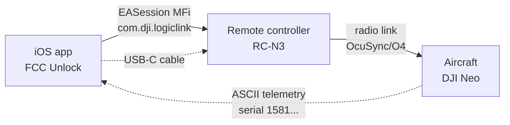
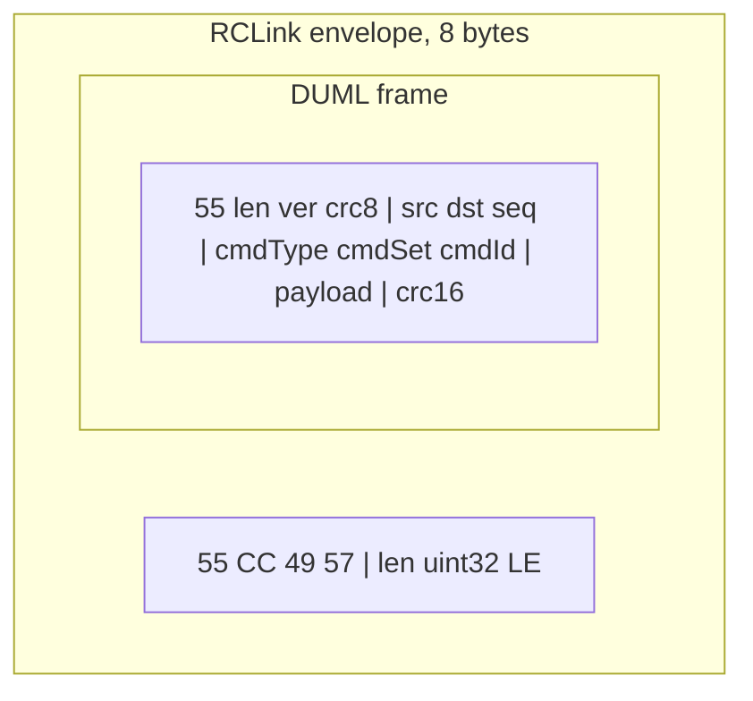
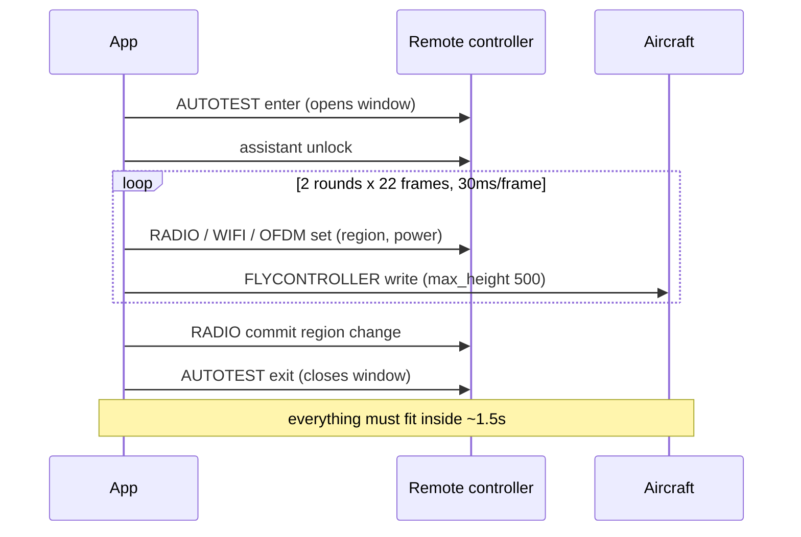

# Technical documentation, FCC Unlock iOS

> 🇬🇧 English version. The Italian original is at
> [DOCUMENTAZIONE-TECNICA.md](DOCUMENTAZIONE-TECNICA.md).

How the app enables FCC mode on a DJI RC-N remote controller, what exactly
changes, why it works, which protocols it uses to talk to the remote and the
aircraft, and everything that was learned from the logs on real hardware.

This document is meant as a reference for future development. Whoever comes
next should be able to understand the logic, reproduce the results, and know
where to put their hands to extend the app without starting from scratch.

Author, Andrea Piani, www.andreapiani.com.
This revision matches app version 1.7 (build 8), September 2026.

---

## Table of contents

1. [What the app does, in one sentence](#1-what-the-app-does-in-one-sentence)
2. [The hardware and software chain](#2-the-hardware-and-software-chain)
3. [The transport layer, MFi ExternalAccessory](#3-the-transport-layer-mfi-externalaccessory)
4. [The protocol stack, DUML/DUMPL and the RCLink envelope](#4-the-protocol-stack-dumldumpl-and-the-rclink-envelope)
5. [DUML frame format on the wire](#5-duml-frame-format-on-the-wire)
6. [Addressing, device types and indices](#6-addressing-device-types-and-indices)
7. [Bootstrap handshake and keepalive](#7-bootstrap-handshake-and-keepalive)
8. [The inbound stream parser](#8-the-inbound-stream-parser)
9. [The FCC sequence, frame by frame](#9-the-fcc-sequence-frame-by-frame)
10. [The service-mode window and timing](#10-the-service-mode-window-and-timing)
11. [The sweep, the apply strategy and response counting](#11-the-sweep-the-apply-strategy-and-response-counting)
12. [Why it works, the three key findings from the logs](#12-why-it-works-the-three-key-findings-from-the-logs)
13. [The hold loop and the CE reversion](#13-the-hold-loop-and-the-ce-reversion)
14. [Reading the region, the honest limit](#14-reading-the-region-the-honest-limit)
15. [The documented RC power mode commands](#15-the-documented-rc-power-mode-commands)
16. [The CE restore](#16-the-ce-restore)
17. [The Experimental tab, reading and writing flight-controller parameters](#17-the-experimental-tab-reading-and-writing-flight-controller-parameters)
18. [Diagnostics, census and probes](#18-diagnostics-census-and-probes)
19. [How to read a session log](#19-how-to-read-a-session-log)
20. [Code map](#20-code-map)
21. [Where things stand, and what is next](#21-where-things-stand-and-what-is-next)

---

## 1. What the app does, in one sentence

The app talks to the DJI remote controller over the cable, using the same
protocol DJI Fly uses, and sends a sequence of commands that move the radio from
the CE region (20 dBm, about 100 mW, European power) to the FCC region (33 dBm, about 2 W, American power), and
also sets the altitude ceiling to 500m. Everything happens on the device, with
no server, no account, no jailbreak.

The central technical point, the thing that was discovered and made reliable, is
that the DJI radio region is decided by the country code. Setting the country
code to `US` puts the radio in FCC. The rest of the sequence exists to get that
command to the right component, inside the right time window, on the right
communication channel.

---

## 2. The hardware and software chain

Communication goes through five links. Knowing where each one sits helps you
understand where an apply can fail.



- **iOS app**, builds the frames, wraps them, writes them to the stream.
- **USB-C cable**, goes into the TOP USB port of the remote, the one in the
  phone cradle. The bottom port is for charging and does not carry the MFi data
  channel.
- **Remote controller**, is an MFi certified accessory. It receives the frames,
  handles some of them itself (radio, WiFi), and forwards others over the radio
  link to the aircraft.
- **Radio link**, the remote forwards commands to the aircraft only if the radio
  link is up, that is, if the aircraft is powered on and linked. This is where a
  "silent" apply is born.
- **Aircraft**, handles the flight controller parameters (altitude, speed) and
  continuously transmits telemetry, inside which its serial number travels in
  plain text.

The last link, the returning telemetry, is what the app uses as the "the
aircraft is there" signal. The `1581...` serial shows up in the stream only when
the aircraft is actually transmitting, so only when the remote is relaying it.
Seeing the serial means knowing the chain is complete.

---

## 3. The transport layer, MFi ExternalAccessory

On iOS the only sanctioned way to talk to a wired accessory is to open an
`EASession` through the ExternalAccessory framework. The code lives in
`FreeFCC/Core/ExternalAccessoryTransport.swift`.

### 3.1 The MFi protocol strings

iOS will not let you open a session on a protocol the app has not declared in
`Info.plist`, under the `UISupportedExternalAccessoryProtocols` key. Worse, iOS
hides the accessory entirely from `connectedAccessories` if none of the strings
the accessory advertises is declared by the app. A wrong list reads exactly like
"no remote controller connected".

Five strings are declared:

```
com.dji.logiclink   <- the command channel, NOT publicly documented
com.dji.protocol     <- documented for third-party SDKs
com.dji.common       <- documented for third-party SDKs
com.dji.fly          <- undocumented, read from DJI Fly
com.dji.video        <- the camera feed
```

The first three are the ones DJI documents for SDK developers. They are not
enough. With only those an RC-N3 stayed invisible, while DJI Fly on the same
cable, at the same instant, connected without any problem. `com.dji.logiclink`
and `com.dji.fly` were read directly from DJI Fly's `Info.plist` on the device:

```bash
ideviceinstaller list -b com.dji.golite \
  -a UISupportedExternalAccessoryProtocols
```

### 3.2 Protocol ranking

When the accessory advertises more than one openable protocol, the app tries
them in an explicit, non-heuristic order, defined in `rankedProtocols(for:)`:

```
logiclink > protocol > common > fly > video
```

`logiclink` first because the name says "logical command channel" and it is the
one the public SDK never mentions. `video` last because a session on that
protocol opens just the same, but behind it there is no command parser, only the
camera feed. Opening video and getting no replies to a command does not mean the
command was rejected, it means you are talking to the wrong channel.

### 3.3 The two threads and why

On real hardware `logiclink` delivers over a megabyte per second, because it
also carries video. With a single run loop for both directions, the thread
spends all its time draining the input and never gets to service the output
stream. Frames pile up in the queue and never leave, while the response count
reads as "the aircraft ignores everything".

This is why receive and transmit each have their own thread (`FreeFCC-EA-RX`,
`FreeFCC-EA-TX`), with their own run loop. The output thread also has a short
timer that periodically re-pumps the queue, so bytes leave even if the stream
never raises the `hasSpaceAvailable` event.

### 3.4 Transport metrics, `RxStats`

The transport measures the difference between "we talked" and "they answered",
which no response count alone can tell apart. In `RxStats`:

| Field | Meaning |
|---|---|
| `bytesQueued` | bytes handed to `write` |
| `bytesWritten` | bytes the stream actually accepted |
| `bytes` | bytes received inbound |
| `framesDecoded` | valid DUML frames extracted from the input |
| `envelopes` / `bareFrames` | how the inbound frames were framed |
| `skippedBytes` | bytes discarded to resynchronise the parser |
| `preview` | first bytes seen on the link, for a hex dump |

A gap between `bytesQueued` and `bytesWritten` means some bytes never left the
phone. Inbound bytes with `framesDecoded` at zero means the link is alive but
the framing is wrong, that is a framing problem, not an aircraft that ignores.

---

## 4. The protocol stack, DUML/DUMPL and the RCLink envelope

DJI uses a command protocol called DUML (sometimes written DUMPL in the code),
publicly documented by the
[dji-firmware-tools](https://github.com/o-gs/dji-firmware-tools) project under
GPL-3.0. The app implements that protocol from scratch, the frames follow the
reference `comm_dat2pcap.py`.

On the MFi link there are two possible framing levels:



- **Bare DUML**, the naked frame starting with `0x55`.
- **RCLink**, the same DUML frame preceded by an 8-byte header that the remote's
  mobile-link parser expects.

The RCLink envelope, defined in `FreeFCC/Core/RCLink.swift`:

```
[0] 0x55        magic 1
[1] 0xCC        magic 2 (RCLink header, distinct from DUML which has only 0x55)
[2] 0x49 ('I')  route byte 1
[3] 0x57 ('W')  route byte 2
[4-7]           length of the inner DUML frame, uint32 little-endian
[8...]          the DUML frame bytes (which in turn start with 0x55)
```

The two route bytes (`49 57`) are a default. The inbound parser updates them
with the ones seen on the last envelope received from the remote, and from then
on the app sends them back, so the route follows the one the remote itself
declares.

The app can send in either framing, and by default it does a **sweep**: it tries
RCLink first, then bare DUML. Which of the two the remote accepts is decided by
the firmware, not by the operating system, so the app tries both and counts who
answers.

---

## 5. DUML frame format on the wire

Built in `FreeFCC/Core/DumplBuilder.swift`. Layout of the `0x55` type packet:

| Byte | Content |
|---|---|
| 0 | `0x55`, magic |
| 1-2 | Length (bits 0-9) + version (bits 10-15), version always 1 |
| 3 | CRC-8 of bytes 0-2 |
| 4 | Sender, device type (low 5 bits) + index (high 3 bits) |
| 5 | Receiver, same encoding |
| 6-7 | Sequence number, little-endian |
| 8 | Command type |
| 9 | Command set |
| 10 | Command ID |
| 11..N | Payload |
| N+1..N+2 | CRC-16 of bytes 0 through N |

### 5.1 The two CRCs

These are the part that, if wrong, makes the remote silently drop the frame.
Both follow the dji-firmware-tools reference tables:

- **CRC-8**, reflected polynomial `0x8C`, init `0x77`, over bytes 0-2 (the
  header).
- **CRC-16**, reflected polynomial `0x1021` (`0x8408`), init `0x3692`, over the
  whole frame except the final two bytes.

The tables are transcribed by hand in the code, but `DumplBuilderTests`
recomputes them bit by bit from the polynomials, so a mistyped value fails the
tests instead of producing frames the remote throws away without a word.

### 5.2 The command type

Byte 8 encodes three things:

- bit 7, packet type: 0 request, 1 response.
- bits 5-6, ack type.
- bits 0-2, encryption.

The values used in practice:

| cmd_type | Meaning |
|---|---|
| `0x20` | Request, ACK_BEFORE_EXEC, no encryption. This is the one used by the FCC sequence. |
| `0x40` | Request with ack. Used for the assistant unlock and the documented RC commands. |
| `0x06` | Request, NO_ACK_NEEDED. Used by the CE restore, fire-and-forget. |

Bit 7 on the inbound frame is how the app recognises a response: `isResponse`
in `DumplResponse`.

### 5.3 The sequence number

There is a single process-wide counter, `SequenceCounter.shared`, starting at
149. Bootstrap, keepalive, FCC and CE restore all draw from it, so two frames in
the same session never carry the same sequence number. The response to a command
carries its `seq`, but the app matches responses to commands by the (command
set, command ID) pair, not by sequence, because the remote transmits unsolicited
telemetry with its own sequences.

---

## 6. Addressing, device types and indices

The sender and receiver bytes encode a device type in the low 5 bits and an
index in the high 3 bits. Knowing who is who is essential to understand why a
frame goes to one destination and not another.

Senders used by the app:

| Name | Value | Who it is |
|---|---|---|
| `senderCapture` | `0x82` | MOBILE_APP, index 4. The value from the original capture, most field reports come from builds using this. |
| `senderNet0` | `0x02` | Network 0, the one bootstrap and keepalive use. |
| `senderWlm` | `0xA2` | For the WLM single-command radio switch. |

Recurring destinations (from the `dst` of the profile frames and the probes):

| dst | Component |
|---|---|
| `0x03` | FLYCONTROLLER, the aircraft's flight controller |
| `0x06` | REMOTE_RADIO, the remote's radio |
| `0x07` | WIFI |
| `0x09` | LB_MCU_SKY, the aircraft-side MCU of the link |
| `0x12` | SVO, the servo/gimbal, used as the destination of the AUTOTEST service-mode |
| `0x18` | camera |
| `0x1F` | broadcast to an aircraft component (WM330/WM220) |
| `0x92` | SVO index 4, an alternative route for some flight controller writes |
| `0xEE` | destination of the WLM single-command switch |

The remote's radio is device type 6. The flight controller is type 3. This is
why the country code and the power limits go to radio/WiFi destinations on the
remote side, while altitude goes to the flight controller on the aircraft side:
they are physically different components on different sides of the radio link.

---

## 7. Bootstrap handshake and keepalive

Defined in `FreeFCC/Core/DumplTransport.swift`.

### 7.1 Bootstrap

As soon as the link opens, the app sends two handshake frames. The remote
ignores every subsequent command until it has seen both.

```
Frame 1  sender 0x02  cmdType 0x40  set 0x00  id 0x00  dst 0x1F  payload 00 00 01
Frame 2  sender 0x02  cmdType 0x40  set 0x00  id 0x00  dst 0x00  payload 00 00 01
```

The first goes to component `0x1F`, the second is broadcast to `0x00`.

### 7.2 Keepalive

The remote expects a pair of keepalives every 2.5 seconds. Without them the
RCLink session drops mid-sequence, and in the log that reads exactly like a
rejected FCC write.

```
sender 0x02  cmdType 0x40  set 0x06  id 0x77  dst 0x06  payload 01 01 00 FF FF 20 00 00
sender 0x02  cmdType 0x40  set 0x06  id 0x77  dst 0x0E  (same payload)
```

Two frames, one to `0x06` and one to `0x0E`. The keepalive timer starts shifted
forward by one interval, because the remote wants the first keepalive one
interval after the link opens, not at the exact instant it comes up.

---

## 8. The inbound stream parser

`DumplStreamParser` in `FreeFCC/Core/RCLink.swift`.

The MFi stream gives no frame boundaries. Bytes arrive in arbitrary chunks, and
the same channel also carries video. So the parser resynchronises at every byte
and emits only the frames whose header CRC-8 and body CRC-16 both check out.
Anything that fails is discarded one byte at a time until the stream realigns.

Scanning logic, at each position:

1. If the byte is not `0x55`, skip it and count one skip.
2. If it is `0x55 0xCC`, it is an RCLink envelope: read the length, validate it
   (>0 and <= 8192), extract the inner payload and pull the DUML frames out of
   it.
3. Otherwise try to read it as a bare DUML frame: read the 10-bit length,
   validate it (>= 13 and <= 1023), verify the header CRC-8 and then the CRC-16
   of the whole frame.

The parser locks onto any valid DUML frame regardless of what surrounds it, and
this is what lets it decode a link whose outer framing is unknown. The
`skippedBytes` count measures how much it is discarding: a pure RCLink link
skips almost nothing, a high skip count means every frame arrives inside a
framing the app does not add when it sends. It is a diagnostic hint, not an
error.

A buffer that never aligns must not grow forever: above 64KB, the parser keeps
only the last 16KB.

`DumplResponse` decodes an inbound frame into its fields (sender, dst, seq,
cmdType, cmdSet, cmdId, payload). The key that matches a response to the command
that asked for it is `(cmdSet << 8) | cmdId`.

---

## 9. The FCC sequence, frame by frame

The heart of the app. The profile is a readable JSON file,
`FreeFCC/Resources/profiles/fcc.json`, so every byte sent can be inspected on
the app's Profile tab. Twenty-two frames, in two rounds, inside a single
service-mode window: an AUTOTEST enter, twenty writes, and an AUTOTEST exit.

Here is what each frame does and why.

| # | set/id | dst | payload | What it does |
|---|---|---|---|---|
| 1 | 16/88 | 18 | `030100` | **AUTOTEST enter**, opens service mode. From here on parameter writes are accepted. |
| 2 | 6/114 | 6 | `00000000000100` | **RADIO set region param to FCC (01)** towards the remote's radio. |
| 3 | 3/249 | 3 | `8a237103f401` | **FLYCONTROLLER write** `flying_limit.max_height = 500` (0x01F4), the altitude ceiling. Hash `0371238a` LE + value. |
| 4 | 3/249 | 3 | `9ad152ae01` | **FLYCONTROLLER write** `advanced_function.height_limit_enabled = 1`, makes the 500m ceiling apply. |
| 5 | 0/0 | 31 | `000001` | **GENERAL activate change** broadcast to the aircraft component. |
| 6 | 0/50 | 111 | `3131000000` | **GENERAL set country code '11'** towards LB_68013_SKY idx 3. |
| 7 | 3/175 | 3 | `032400...` | **FLYCONTROLLER write param** (cmd 0xAF). |
| 8 | 7/48 | 9 | `5553...0100` | **WIFI Set Country Code US 2.4G**. `US` = 5553 hex, the documented FCC trigger. |
| 9 | 7/48 | 9 | `5553...0100` | **WIFI Set Country Code US 5.8G**. |
| 10 | 9/39 | 9 | `00024800ffff0200000000` | **OFDM set power limit 2.4G**. |
| 11 | 9/39 | 9 | `00026300ffff0300000000` | **OFDM set power limit 5.8G**. |
| 12 | 7/24 | 7 | `ff555300` | **WIFI write channel map US**. |
| 13 | 7/25 | 9 | `c0` | **WIFI set channel flag**. |
| 14 | 3/249 | 146 | `d04aeffb01` | **FLYCONTROLLER write param ON** towards SVO idx 4. |
| 15 | 3/249 | 146 | `d04aeffb00` | **FLYCONTROLLER write param OFF** towards SVO idx 4. |
| 16 | 0/229 | 111 | `323201` | **GENERAL set country code '22'**. |
| 17 | 3/249 | 3 | `236b820101` | **FLYCONTROLLER write param** (cmd 0xF9). |
| 18 | 3/249 | 3 | `8773e68a01` | **FLYCONTROLLER write param** (cmd 0xF9). |
| 19 | 6/140 | 9 | `000300` | **RADIO set parameter 03**. |
| 20 | 6/140 | 9 | `000100` | **RADIO set parameter 01**. |
| 21 | 6/114 | 6 | `000000000001ff` | **RADIO commit region change**, closes and confirms the region change. |
| 22 | 16/88 | 18 | `030100` | **AUTOTEST exit**, closes service mode. |

Before each round the app also sends an **assistant unlock** (set 0x03, id
0xDF, dst 0x03, payload `01 00 00 00`, cmd_type 0x40), which unlocks the flight
controller for parameter writes. It is sent once per pass, not before every
FLYCONTROLLER frame, because sending it every time stretched the burst well
beyond the service-mode window.

### 9.1 The three command families

The twenty-two frames fall into three groups, with three different logical
destinations:

- **Radio region and power**, towards the remote and the link (set 6 RADIO, set
  7 WIFI, set 9 OFDM, set 0 GENERAL with the country codes). This is the part
  that actually moves CE to FCC.
- **Altitude**, towards the aircraft's flight controller (set 3 FLYCONTROLLER,
  `max_height` and `height_limit_enabled`).
- **Service-mode framing**, the first and last frame (set 16 AUTOTEST), which
  open and close the window everything else must fit inside.

### 9.2 The country code, the real mechanism

The most important technical fact: the radio region is not set with an "FCC
on/off" flag, it is set by choosing a country. The `US` country code puts the
radio in FCC and makes it ask the aircraft to follow. The dji-firmware-tools
dissector comment on WiFi Set Country Code says so explicitly. `US` on the wire
is `55 53` (the two ASCII characters), hence the `5553...` payloads of frames 8
and 9.

The other country codes in the sequence (the `'11'`, `'22'` of the GENERAL
frames) and the OFDM/RADIO commands are the choreography some firmwares expect
around the change, taken from the original capture. The signal that matters,
verified on the RC-N3, is the US country code.

---

## 10. The service-mode window and timing

This is the constraint that makes or breaks an apply, and it is the reason for
precise concurrency choices in the code.

Frame 1 (AUTOTEST enter) opens a service-mode window. The closing frame
(AUTOTEST exit) closes it. The twenty frames in between must land inside
that window. If the burst stretches beyond a few seconds, the window closes
first, the subsequent writes fall into the void, and the radio silently stays on
CE while every single write reports "sent successfully".

This is why the bursts do NOT run on the Swift concurrency cooperative pool.
They run on a dedicated serial queue (`engineQueue`) and sleep with
`Thread.sleep`. The timing from the profile:

```
inter_frame_delay_ms  30    delay between one frame and the next
inter_round_delay_ms  100   delay between the two rounds
rounds                2     number of rounds of the sequence
read_window_ms        50    listening window to count responses
```

At 30ms per frame, a complete two-round pass takes about 1.5 seconds, well
inside the window. Scheduling those delays through the cooperative pool would
stretch them, and a stretched burst is exactly the case where every write
succeeds and the radio stays on CE. The comment in the `FccController` code says
so openly, and it is the most expensive lesson learned from the logs.



---

## 11. The sweep, the apply strategy and response counting

The app does not know in advance which combination of sender byte and framing
your hardware accepts, so it tries them and counts who answers. The logic is in
`applyFccSync(profile:paths:)`.

### 11.1 The paths

A path is a (sender byte, framing) pair. The default sweep tries four paths:

```
0x82 / RCLink
0x02 / RCLink
0x82 / Raw DUML
0x02 / Raw DUML
```

The framing mode is configurable (Sweep both, RCLink only, Raw only). For each
path the app sends one complete pass of the sequence, then opens a listening
window of `read_window_ms` and counts how many responses come back matched to
the (set, id) pairs of the frames that were sent.

### 11.2 Waiting for the aircraft before sweeping

Before starting, the apply waits for the aircraft to appear on the link, for up
to 20 seconds (`waitForAircraft`). The aircraft serial only shows up in the
telemetry the aircraft itself transmits, and the aircraft transmits nothing
until the remote has re-linked to it. An apply launched earlier reaches the
remote and stops there, which is the zero responses that reads as a dead
sequence. Waiting here is what makes an apply land on the first attempt instead
of the third.

### 11.3 The winner

The path with the most responses becomes the `preferredPath`. From that moment
the keepalive and the hold loop use that framing. If no path responds but the
frames went out and the aircraft is linked, the app holds anyway (see section
13), because this firmware does not answer any region read command and the real
confirmation is only the DJI Fly graph.

### 11.4 The WLM single-command switch

After the profile passes, the app also tries a single-command radio switch (set
0x51, id 0x04, dst 0xEE, sender 0xA2), an alternative route. It goes last so it
never delays the service-mode entry for the profile passes.

### 11.5 Honesty about state

The code keeps "the bytes went out" and "the aircraft accepted" strictly
separate. There are distinct states:

- `fccEnabled`, the remote responded, or it took the sequence with the aircraft
  linked and we are holding.
- `sentUnconfirmed`, the frames went out but no aircraft was on the link.
- `connected`, apply failed, no frame reached the transport.

Treating the two as the same thing is how you end up with a green FCC badge over
a radio that never left CE. A silent sweep has its own state, it does not borrow
the success one.

---

## 12. Why it works, the three key findings from the logs

Three things had to be right, and finding them was the work. They are documented
in the README as "confirmed on hardware" and come from the logs on RC-N3 + DJI
Neo.

### 12.1 The channel is `com.dji.logiclink`

One of the two MFi protocol strings DJI does not publish. A build that declares
only the three documented strings does not see the remote at all, because iOS
hides an accessory whose protocols you have not declared. The string was read
from the hardware, from DJI Fly's `Info.plist`.

### 12.2 The region is set with the US country code

The command is the WiFi Set Country Code the remote already accepts. The country
it carries is what decides CE or FCC. No secret command was needed, what was
needed was understanding that the right parameter was the country, not a power
flag.

### 12.3 The aircraft must be linked at apply time

Powering it on is not enough, it must be linked. The frames reach the remote and
stop there until it is relaying to an aircraft. The app shows a green line with
the aircraft serial when it is there. This explains the mandatory operating
order: open DJI Fly first to wake up the link, close it, then connect and apply
inside the warm window.

### 12.4 The honest limit

This firmware does not answer any region read command, so the app cannot read
the mode back. The DJI Fly Transmission graph, with the signal extending well
beyond the 1km reference, is the confirmation.

---

## 13. The hold loop and the CE reversion

FCC is RAM based. On some aircraft it survives a power cycle, on others it goes
back to CE. Two resets are observed in the logs:

- DJI Fly reconnecting.
- The aircraft dropping to CE the instant it sets the home point on GPS lock.

The known remedy for both is to re-apply. This is why, once enabled, the app
re-runs the winning pass on an interval (`repeat_interval_ms`, 4 seconds in the
current profile). The timer runs on the `engineQueue`, sends the profile pass
plus the WLM switch, and keeps going as long as the session is open. iOS lets
the app keep the session open in the background (`external-accessory`
background mode in `Info.plist`), so the hold survives while DJI Fly runs in the
foreground.

The repeat interval was tightened on purpose, so the reversion windows are
shorter.

---

## 14. Reading the region, the honest limit

The app would like to read the current mode to show a real CE/FCC indicator. The
profile sets the region via RADIO 6/0x72, a command this RC-N3 never answers.
The `probeRegionCommand()` probe exists precisely to look for a destination that
answers RADIO 6/114 on both request types (0x20 and 0x40), across a destination
list taken from the census of who actually talks on the link.

The result on the RC-N3: the four frames that actually move the region (RADIO
6/114 and the GENERAL frames with the country codes) do not answer, while the
fourteen peripheral writes around them do. A simply rejected command would still
answer, so the silence indicates the frame does not reach a component that
handles it, which makes the destination byte the thing to vary. This is the
thread the probe follows.

---

## 15. The documented RC power mode commands

The dji-firmware-tools dissector names a different mechanism from the profile's,
the one DJI Fly itself sends every session. Implemented in `applyFccRcMode()`
and `readPowerMode()`:

| Command | set/id | What it does |
|---|---|---|
| RC Power Mode Set | 6/0x20 | Sets the remote's power mode, `01` = FCC |
| RC Power Mode Get | 6/0x21 | Reads the current mode, byte 0 of the payload, 0 = CE, 1 = FCC |
| WiFi Set Country Code | 7/0x30 | Sets the country code, `US` puts it in FCC |

The country code payload is `str1(4) + str2(4) + unknown(2)`, according to the
dissector, hence `countryPayload("US")` produces `55 53 00 00 55 53 00 00 01 00`.

`applyFccRcMode()` does the clean thing: it sends country US, then RC power mode
FCC, then reads back with a Get and reports what it really is. It is RAM-only, a
power cycle undoes it. This is the "documented" path, an alternative to the
capture profile, useful for development and for firmwares that answer the Get.

---

## 16. The CE restore

`FreeFCC/Resources/profiles/ce_restore.json`, a single frame:

```
sender 130  cmdType 0x06 (NO_ACK)  set 6  id 114  dst 32  payload 00000000000100
```

It returns the radio to the factory region (CE for CE units, FCC for FCC
units). It is the safe undo of FCC mode. The region restore command is the only
DUML command that dji-firmware-tools documents and that is not license-gated, so
it works on all remotes and aircraft. The app sends it on both sender bytes and
on all the selected framings, for the same reason the apply does the sweep.

---

## 17. The Experimental tab, reading and writing flight-controller parameters

`FreeFCC/Core/Experimental.swift` holds the parameter tables, the probes live in
`FccController` under the `Experimental` marks. Everything here addresses the
flight controller's config table by the hash of the parameter name, on the
FLYCONTROLLER command set (0x03), with the same by-hash verbs the FCC profile
already uses. The hashes come from the public dji-firmware-tools tables and were
verified with DJI's own name-hash function: the known parameters reproduce their
documented hashes bit for bit, so generated candidates address real parameters
when they exist and are ignored when they do not.

What each verb does on this firmware (RC-N3 + DJI Neo, FW v00.05.00.12):

| Verb | id | On this firmware |
|---|---|---|
| Get Param Info By Hash | 0xF7 | No reply, swept across sender 0x82/0x02, cmd_type 0x20/0x40 and dst 0x03/0x92, each in its own service window |
| Read Value By Hash | 0xF8 | No reply, same sweep |
| Write Value By Hash | 0xF9 | Answered. For the limit parameters the reply carries status + hash + the value actually stored; for the control parameters it carries the status only |
| Read Params By Hash, multiple | 0xFB | Sent since v1.2 (flag byte + hash, sweeping flag, cmd_type and dst). No hardware result recorded yet |

So the read channel that exists today is the `0xF9` write echo, and only for the
limit parameters. That single fact shapes everything below.

### 17.1 The six tools

| Button on the tab | Method | Writes | What it does |
|---|---|---|---|
| Read Attitude Parameters | `probeSpeedParams()` | nothing | Two-phase 0xF7/0xF8 probe. Phase 1 looks for a read context that answers, using `max_height` as the known value; phase 2 reads every parameter on it. On failure it dumps the set 0x03 census, so a mis-keyed reply is still visible |
| Probe 500m Gate | `probeAltitudeGate()` | altitude and geo limits | Writes one candidate at a time and decodes the 0xF9 echo, to bisect toward the parameter that opens the DJI Fly slider past 120 (v1.1) |
| Read via 0xFB | `probeReadFB()` | nothing | Pure read of the geo/authority values and the attitude ranges over 0xFB, sweeping flag, cmd_type and dst until one answers (v1.2) |
| Read Flight Telemetry | `readTelemetry()` | nothing | Decodes the latest OSD General push (set 0x03, id 0x43): height, ground speed from Vgx/Vgy, flight mode; plus the Limit State push (id 0x55) (v1.2) |
| Record Sport Flight | `recordFlight(seconds:)` | nothing | Samples the OSD push for 30 seconds on its own queue and reports the peak horizontal speed and height, the ground truth for the speed work (v1.6) |
| Boost Sport Speed | `applySpeedBoost()` | flight-control parameters | Warmth check, then float32 writes of `atti_limit` 45, `atti_range` 40, `horiz_vel_atti_range` 40 (degrees), `vert_up_vel` 6 and `vert_down_vel` 6 (m/s), each with its 0xF9 echo (v1.3 to v1.5) |

Green buttons only read. The amber one writes limits, the class of parameter the
FCC apply already writes. The red one writes control parameters, which change how
the aircraft handles: it is flight-safety territory and has to be flown low and
slow in open space. Every write is RAM-only, a CE restore or a power cycle resets
it.

### 17.2 The window discipline

Each read or write sits inside its own tight service-mode window: AUTOTEST enter,
assistant unlock (set 0x03, id 0xDF), the one frame, then AUTOTEST exit, with a
200 ms capture on the expected reply key. The same timing note as the profile
applies here: a burst stretched beyond a few seconds silently does nothing. The
first probe kept a single window open across all the parameters, about three
seconds, and that is why it got no answer. Writes are tried on dst 0x03 first and
on the SVO route 0x92 if nothing echoes.

### 17.3 What the hardware said

- `max_height` written to 500 is acknowledged with status 0, but the echo is
  `00 8A 23 71 03 78 00`: the drone stores 120. Reproduced across sessions and
  again after the float writes of v1.4. The ceiling is enforced drone-side and
  `max_height` alone does not lift it (issue #1).
- 0xF7 and 0xF8 never answer, in any combination tried. The flight controller is
  not mute: during the probe the census shows it pushing on set 0x03 (id 0xD7 in
  the thousands, id 0xCE from the responder behind sender 0x92, plus 0x53, 0x09,
  0x42). The reads are ignored, not lost (issue #2).
- The v1.3 integer writes to the attitude parameters were ignored, full-stick
  Sport stayed at the normal cap. That is the signature of the wrong width: these
  parameters are 4-byte floats, so v1.4 writes them as little-endian float32. The
  flight controller clamps out-of-range writes to its own maximum.
- The control-parameter writes come back with status 0 and no value, unlike
  `max_height`. The echo alone cannot say whether the value stuck, which is why
  the flight recorder exists: the measured peak km/h is the only ground truth
  (issue #3).

### 17.4 The warmth gate

A cold link and a wrong write both look like "no echo". `linkIsWarm()` removes the
ambiguity: it writes `max_height` (the value the apply already sets) and looks
for its 0xF9 echo, which only comes back when the controller is relaying to the
aircraft. The Sport boost runs it first and writes nothing on a cold link,
telling the user to warm DJI Fly to the live camera and retry within about
fifteen seconds. It is a link sensor, not a region sensor: it says nothing about
CE or FCC (issue #6).

### 17.5 The parameter tables

Altitude-gate candidates, written one at a time by Probe 500m Gate:

| Parameter | Hash | Written | Why |
|---|---|---|---|
| `flying_limit.max_height_0` | `0x0371238a` | 500 (u16) | The ceiling the app already writes; the drone clamps it to 120 |
| `advanced_function.height_limit_enabled_0` | `0xae52d19a` | 0 (u8) | Turn height-limit enforcement off (the apply writes 1) |
| `novice_cfg.max_height_0` | `0xd9ab9f79` | 500 | Beginner-mode ceiling |
| `airport_limit_cfg.cfg_disable_airport_fly_limit_0` | `0x8fb32a2d` | 1 | Disable airport/NFZ limits |
| `flying_limit.height_limit_num_0` | `0x11ce86a4` | 500 | Candidate, a separate height-limit value |
| `flying_limit.height_limit_0` | `0x85ad07a3` | 500 | Candidate, height limit |
| `flying_limit.max_height_type_0` | `0xa61867e2` | 1 | Candidate, height-limit type or zone selector |
| `flying_limit.enable_flying_limit_0` | `0x510882c8` | 0 | Candidate, disable the flying limit entirely |
| `flying_limit.limit_gps_not_ready_max_height_0` | `0x642acdc9` | 500 | Candidate, GPS-not-ready ceiling |

Parameters read by Read via 0xFB (and, through 0xF7/0xF8, by Read Attitude
Parameters):

| Parameter | Hash | What it is for |
|---|---|---|
| `flying_limit.max_height_0` | `0x0371238a` | Altitude ceiling, the self-check (expect 120) |
| `flying_limit.max_radius_0` | `0x425c0a94` | Distance ceiling |
| `api_entry_cfg.authority_level_0` | `0x7b24ba4b` | SDK/API authority level, the 500m-gate candidate |
| `api_entry_cfg.height_data_type_0` | `0x96a0a2cf` | Height data type |
| `control.atti_range_0` | `0x9da51eee` | Attitude range, caps Sport speed |
| `control.horiz_vel_atti_range_0` | `0xde0fff00` | Horizontal-velocity attitude range |
| `control.atti_limit_0` | `0x9f9646e9` | Caps the maximum of `atti_range` |
| `control.horiz_emergency_brake_tilt_max_0` | `0x3d833d3a` | Emergency-brake tilt maximum |

Values written by Boost Sport Speed, all little-endian float32, each inside
its own service window and read back from the 0xF9 echo:

| Parameter | Hash | Written | Why |
|---|---|---|---|
| `control.atti_limit_0` | `0x9f9646e9` | 45.0 deg | Raise the cap on `atti_range` first |
| `control.atti_range_0` | `0x9da51eee` | 40.0 deg | Max tilt in GPS/Sport, drives horizontal speed |
| `control.horiz_vel_atti_range_0` | `0xde0fff00` | 40.0 deg | Horizontal-velocity attitude range |
| `control.vert_up_vel_0` | `0x3d45f2c8` | 6.0 m/s | Max ascent speed, about 3 on the stock Neo |
| `control.vert_down_vel_0` | `0x70dbcaa7` | 6.0 m/s | Max descent speed |

The Read Attitude Parameters probe also covers
`advanced_function.height_limit_enabled`, `novice_cfg.max_height` and
`airport_limit_cfg.cfg_disable_airport_fly_limit`, and would print the type,
size, min, max and default from a Get Info reply if this firmware ever answered
one.

---

## 18. Diagnostics, census and probes

Tools to understand what is going on when something does not add up.

### 18.1 The frame census

Every inbound frame is counted by (sender, dst, set, id), with a sample of the
last payload. `dumpTraffic()` prints everything sorted by how much each type
talks, and flags frames from the RADIO set (0x06), which are the most likely to
carry the region byte. It is completely passive, it sends nothing. The value is
in the frames the aircraft emits on its own: a DUML link tends to broadcast its
own state, so the RADIO set, especially the state push, is where the current
region and power limits are most readable.

### 18.2 The network probe

`NetworkProbe` and `runDiagnostics()`. Checks whether the remote exposes itself
over USB-C as a network device instead of an MFi accessory, which is how DJI
reaches the smart remotes. If a new network interface appears when the cable is
plugged in, that is another door to knock on, and MFi program membership is not
needed to use it. The DUML command proxy port on smart remotes is TCP 40009. The
probe enumerates the interfaces, diffs them against the baseline taken at
startup, and tries a non-blocking TCP connect with a short timeout towards the
typical addresses of a USB gadget.

### 18.3 The dual-destination log

`DiagnosticLog` writes every line to two places that survive the app closing:
the unified log (visible live in the Xcode console) and a text file in the app
container, which can be pulled later with `devicectl device copy from` or opened
in Files. The streaming filter:

```bash
log stream --predicate 'subsystem == "com.andreapiani.freefcc"'
```

The session file is at `Documents/freefcc-session.log`. The in-app Log tab only
keeps the last 200 lines and dies with the process, a run on real hardware is
worth more.

---

## 19. How to read a session log

The lines that matter and what they mean.

| Log line | Meaning |
|---|---|
| `Accessory: DJI ...` + `protocols: ...` | The remote is seen, with its protocols. If missing, iOS does not see it, check the strings in Info.plist. |
| `not declared in Info.plist: ...` | The accessory advertises a protocol this build cannot open. If the command channel is there, adding it and rebuilding is the whole fix. |
| `Connected over com.dji.logiclink` | Session open on the right command channel. |
| `Aircraft detected: 1581...` | The aircraft serial showed up in the telemetry, that is, the remote-aircraft link is up. This is the green light for an apply. |
| `Waiting for the aircraft to link...` | The apply is waiting for the aircraft before sweeping. |
| `profile@02/RCLink: 38 responses` | The path (sender 0x02, RCLink framing) received 38 responses. High number = that path works. |
| `RSP 02→82 seq=... set=06 id=... [payload]` | A response matched to a sent command, with the first bytes of the payload. |
| `No responses on any path` | The remote is not relaying to the aircraft. It is NOT the same as FCC rejected. |
| `RX: N bytes, M frames decoded` | Bytes received and valid frames extracted. High bytes with zero frames = framing problem. |
| `TX: N of M bytes actually written` | If N < M, some bytes never left the phone. |
| `Inbound framing: X RCLink envelopes, Y bare frames, Z bytes skipped` | How the far end frames what it sends, the best guide on how it expects to be spoken to. |
| `Applied ... holding by re-applying` | Sequence taken with the aircraft linked, the app holds by re-applying because the region cannot be read back here. |

Golden rule when reading a log: always distinguish three things that look the
same if you only look at the response count, the dropped session (missed
keepalives), the unlinked aircraft (no relay), and the wrong framing (inbound
bytes, no decoded frames). The `RxStats` fields exist precisely to tell them
apart.

---

## 20. Code map

```
FreeFCC/
  Core/
    DumplBuilder.swift          frame building, CRC-8/CRC-16 tables and verification, sequence counter
    RCLink.swift                RCLink envelope, inbound stream parser, DumplResponse
    DumplTransport.swift        transport protocol, RxStats, bootstrap, keepalive
    ExternalAccessoryTransport.swift   MFi transport, protocol ranking, RX/TX threads, serial sniffing
    FccController.swift         all the business logic, connect, apply, sweep, hold, region, diagnostics, experimental probes
    ProfileLoader.swift         loading and decoding of the JSON profiles
    Experimental.swift          parameter tables by hash: read set, altitude-gate candidates, 0xFB read set, Sport boost values, OSD decoder
    NetworkProbe.swift          interface enumeration, TCP probe towards USB gadget
    DiagnosticLog.swift         log mirror to unified log and container file
  App/                          SwiftUI screens (FCC, Log, Profile, Experimental, About) and design system
  Resources/profiles/
    fcc.json                    the FCC + 500m sequence
    ce_restore.json             the single-frame CE restore
FreeFCCTests/                   tests on frames, parser, profile, altitude
docs/
  TECHNICAL-DOCUMENTATION.md    this document (English)
  DOCUMENTAZIONE-TECNICA.md     the Italian original
  screenshots/                  the README images (retake: simulator build, launch with -initialTab N)
```

Entry points to understand the flow:

- For **the protocol**, start from `DumplBuilder.swift` (frame format) and
  `RCLink.swift` (framing and parsing).
- For **what is sent**, read `fcc.json`, every frame has a note.
- For **how and when it is sent**, read `FccController.applyFccSync` and
  `sendPass`, plus the timing notes.
- For **the channel**, read `ExternalAccessoryTransport.swift` and the strings
  in `Info.plist`.
- For **the experimental probes**, start from the tables in `Experimental.swift`,
  then the `Experimental` marks in `FccController.swift` (section 17).

---

## 21. Where things stand, and what is next

Aligned with app version 1.7 (build 8). Done and confirmed on hardware: FCC power
on RC-N3 + DJI Neo. The rest is open reverse engineering, mapped onto the
repository issues, and the Experimental tab already ships the tool each issue
needs. What is missing on every one of them is a hardware run with the log
posted.

- **500m altitude (#1)**. Shipped: the altitude-gate probe (v1.1) and the 0xFB
  read (v1.2). Known: `max_height` is stored as 120 whatever is written. Next:
  run Probe 500m Gate, note which candidates the drone stores and which it
  clamps, open DJI Fly after each and see whether the slider passes 120, then
  bisect to the gate and add it to `fcc.json`. If nothing drone-side opens it,
  the cap lives in DJI Fly's GPS zone logic.
- **A working config-table read (#2)**. Known: 0xF7 and 0xF8 are dead on this
  firmware, the 0xF9 echo returns a value for limits only. Shipped: Read via
  0xFB (v1.2), result not yet recorded. Next: run it and post the log. If 0xFB
  is dead too, the write echo stays the only channel for limits and the flight
  recorder stays the ground truth for control parameters.
- **~60 km/h on Sport (#3)**. Shipped: the staged boost as float32 writes
  (v1.4), the warmth gate (v1.5) and the flight recorder (v1.6). Known: integer
  writes were ignored, float writes are acknowledged without a value echo. Next:
  a warm boost followed by Record Sport Flight, full stick in open space, and the
  measured peak km/h decides whether to step the values up. Bounded at about 60,
  never unlimited.
- **Dropping the "open DJI Fly first" step (#4)**. Shipped: the warmth gate,
  which tells a cold link from a wrong write. Missing: the initialisation DJI Fly
  sends that flips the controller into relaying. Next: Dump All Traffic right
  after DJI Fly connects, find the frames the app-to-RC direction carries, add
  the minimum to the connect sequence. Success is 38 responses on a cold start.
- **Testers on RC-N1 / RC-N2 and other aircraft (#5)**. Still confirmed on one
  pair only. No code required: a device, the Log tab share button, and the
  protocol string the controller advertises.
- **Reading the region back (#6)**. Nothing in the app decodes it yet. The lead
  is the RADIO status push (set 0x06, id 0x05) the controller broadcasts
  continuously; capture it on CE and again after an FCC apply, diff the payload,
  then drive a live CE/FCC badge from it. The warmth gate is a link sensor, not a
  region sensor.

Every issue lists what is known, the exact hashes and commands, and the next
concrete step. The fastest way to contribute is still to run the app on real
hardware and post the log: a finding from a device is worth as much as code.

---

© 2026 Andrea Piani · [andreapiani.com](https://www.andreapiani.com) · PolyForm
Noncommercial License 1.0.0. The DUML protocol implemented is publicly documented by the
[dji-firmware-tools](https://github.com/o-gs/dji-firmware-tools) project, the
iOS app and its logic are original work.
